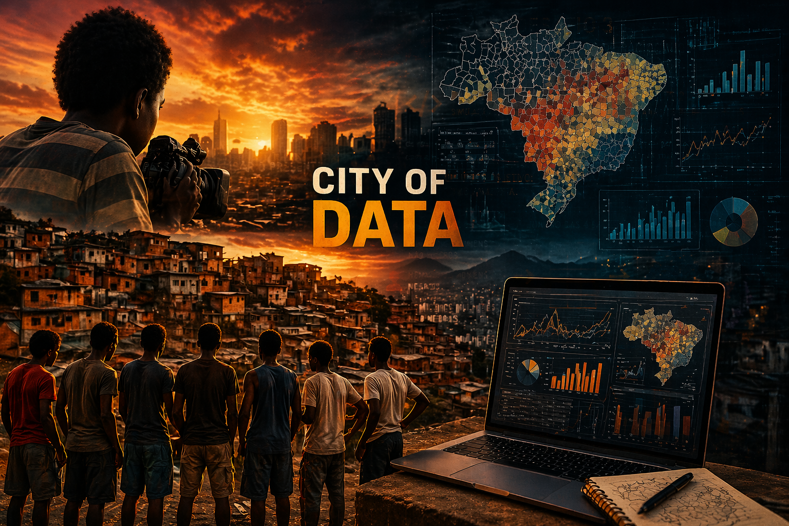

# Desafio 03 (Terceira Tarefa Avaliativa)

**Pessoal, para o Desafio 3, trabalharemos com duas frentes independentes:**

1.  o pacote `proton` do R, que funciona como um jogo/simulação;

2.  os dados do Atlas da Violência.

**A proposta aqui não é conectar artificialmente essas duas coisas. Cada parte tem um objetivo específico.**

# Parte 1: Simulação com o pacote `proton`

O pacote `proton` no R simula uma atividade de *hacking*. Na prática, ele foi construído para testar a capacidade de vocês de manipular dados, de trabalhar com funções, e de lidar com estruturas iterativas.

Atente-se para o fato de que o jogo é composto por quatro fases progressivas!

**Entregável desta parte:** Um *script* em R contendo a solução de todas as fases do jogo. Esse *script* deve estar completamente comentado com explicações claras do raciocínio adotado em cada etapa, evidenciando o que cada trecho de código está fazendo.

**Se eu não conseguir entender a lógica de vocês lendo o *script*, considerarei a tarefa como incompleta.**

 

# Parte 2: Análise de dados reais

Aqui, nós trabalharemos com o [Atlas da Violência](https://www.ipea.gov.br/atlasviolencia/filtros-series).

O Atlas da Violência é uma iniciativa desenvolvida pelo [Instituto de Pesquisa Econômica Aplicada (IPEA)](https://www.ipea.gov.br/portal/), em parceria com o [Fórum Brasileiro de Segurança Pública](https://forumseguranca.org.br/), que reúne, organiza e disponibiliza dados sobre violência no Brasil.

Esses dados são construídos a partir de bases oficiais, como o [Sistema de Informações sobre Mortalidade (SIM)](https://www.gov.br/saude/pt-br/composicao/svsa/sistemas-de-informacao/sim), e permitem analisar, ao longo do tempo, as
taxas de homicídio violência letal recortes por sexo, idade e raça/cor, além de diferenças regionais.

No Atlas da Violência, nosso foco será na seção Violência por Raça, na qual estão disponíveis quatro bases de dados:

- Homicídios de homens não negros;
- Homicídios de homens negros;
- Homicídios de mulheres não negras;
- Homicídios de mulheres negras.

**Para esta atividade, vocês deverão trabalhar exclusivamente com os municípios do estado de São Paulo, durante o ano de 2023.** Assim, qualquer análise fora desse recorte será considerada incorreta.

**Os entregáveis da Parte 2 serão os seuintes:**

- Uma única tabela final, construída a partir da junção dos quatro *datasets* abaixo:

  - homicídios de homens não negros;
  - homicídios de homens negros;
  - homicídios de mulheres não negras;
  - homicídios de mulheres negras.

 

- Mapas temáticos comparativos para o estado de São Paulo, considerando separadamente:
  - homicídios de homens não negros;
  - homicídios de homens negros;
  - homicídios de mulheres não negras;
  - homicídios de mulheres negras.

Os mapas devem permitir comparação visual clara entre os grupos. Não basta apenas plotar, isto é, a visualização precisa ser informativa.

 

**Todo o código em R devidamente comentado, de modo que qualquer pessoa consiga entender o que foi feito e replicar os resultados.**

*Dica: o shapefile dos municípios do estado de São Paulo pode ser obtido no site do Instituto Brasileiro de Geografia e Estatística (IBGE).*