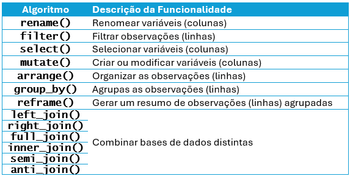
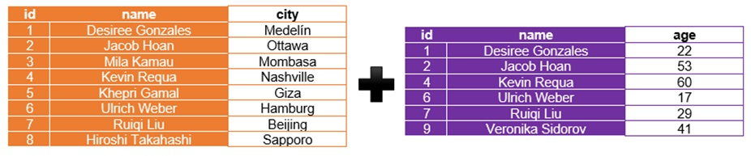
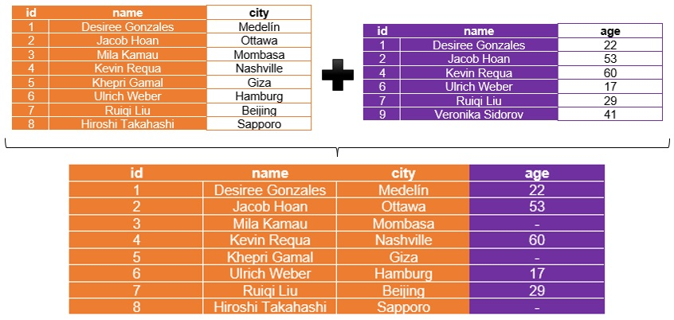
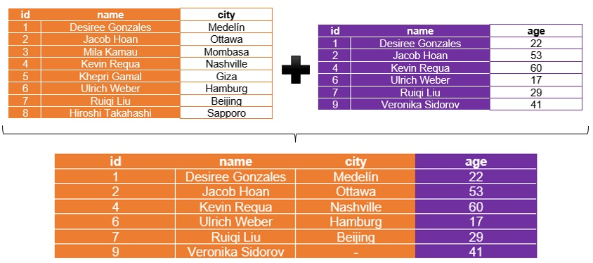
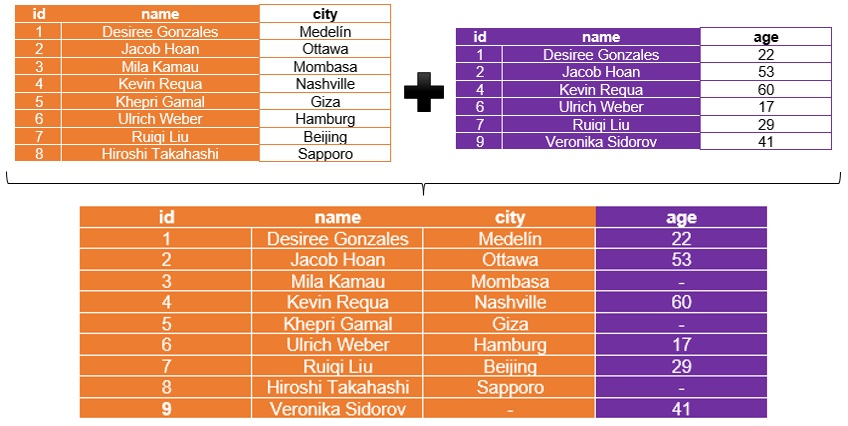
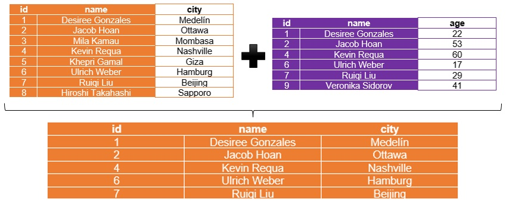
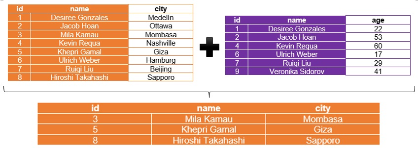

Hoje nós vamos nos aprofundar no mundo da manipulação de dados e, para isso, vamos aprender um pouco sobre o pacote `tidyverse`.

O `tidyverse` é um metapacote, isto é, um pacote que reúne vários outros pacotes bastante úteis para diferentes etapas do trabalho com dados, como importação, organização, transformação, tratamento e visualização. Você pode saber mais sobre ele no site oficial do projeto, clicando [aqui](https://www.tidyverse.org).

Na prática, o `tidyverse` tornou o R muito mais fluido, intuitivo e elegante para trabalhar com dados. Na minha opinião, depois que você aprende `tidyverse`, fica difícil querer voltar atrás.

Podemos visualizar os pacotes associados ao tidyverse da seguinte maneira:
```{r echo=TRUE, message=FALSE, warning=FALSE, paged.print=FALSE}
library(tidyverse)

tidyverse_packages()
```

Apesar de o `tidyverse` envolver vários pacotes, quando executamos `library(tidyverse)`, apenas alguns deles são carregados automaticamente. Entre os principais estão `dplyr`, `ggplot2`, `forcats`, `tibble`, `readr`, `stringr`, `tidyr` e `purrr`. Esse conjunto é frequentemente chamado de core `tidyverse`.

Em outras palavras, a rotina abaixo:

```{r echo=TRUE, message=FALSE, warning=FALSE, paged.print=FALSE}
library(dplyr)
library(ggplot2)
library(forcats)
library(tibble)
library(readr)
library(stringr)
library(tidyr)
library(purrr)
```


**pode ser substituída simplesmente por:**


```{r echo=TRUE, message=FALSE, warning=FALSE, paged.print=FALSE}
library(tidyverse)
```


Porém, a grande vantagem do `tidyverse` não está apenas em reunir pacotes. **Ela também está na forma como passamos a escrever nosso código.**

Até aqui, vocês fizeram várias operações separadamente: primeiro selecionavam colunas, depois filtravam linhas, depois criavam novas variáveis, e assim sucessivamente. Tudo isso em etapas independentes.

Era algo assim:

```{r echo=TRUE, message=FALSE, warning=FALSE, paged.print=FALSE}
data("mtcars")

carros <- mtcars[, c(1,4)]

carros <- carros[which(carros$mpg > 11), ]

carros["kml"] <- carros$mpg * 0.425144

plot(carros$hp, carros$kml)
```

Funciona? Sim. Está errado? Não. Porém, existe uma forma muito mais organizada, legível e elegante de fazer a mesma coisa.

**Meus pequenos padawans, bem-vindos ao lado correto da força!** A partir de agora, vamos começar a encadear operações de maneira lógica, **como se estivéssemos montando uma linha de raciocínio passo a passo.**

Com o `tidyverse`, a mesma rotina pode ser escrita assim:

```{r echo=TRUE, message=FALSE, warning=FALSE, paged.print=FALSE}
mtcars |>  
  select(mpg, hp) |> 
  filter(mpg > 11) |> 
  mutate(kml = mpg * 0.425144) |> 
  ggplot() +
  geom_point(aes(x = hp, y = kml)) +
  geom_smooth(aes(x = hp, y = kml)) +
  labs(x = "Cavalos de Potência",
       y = "Consumo em km/L") +
  theme_bw()
```
Percebam a diferença: agora o código acompanha melhor o raciocínio analítico. Primeiro selecionamos as variáveis de interesse, depois filtramos os casos desejados, em seguida criamos uma nova variável e, por fim, produzimos o gráfico. Tudo isso de forma encadeada, limpa e muito mais fácil de ler.

É exatamente essa lógica que torna o `tidyverse` tão poderoso: ele ajuda você não apenas a fazer a análise, mas também a organizar o pensamento analítico.


## Do Começo: Nosso novo melhor amigo, o operador *pipe*: `|>`

O operador `|>` significa algo como: **“R, segura aí que eu ainda não terminei de falar.”**


Vamos observar novamente a última rotina:

```{r}
mtcars |> 
  select(mpg, hp) |> 
  filter(mpg > 11) |> 
  mutate(kml = mpg * 0.425144) |> 
  ggplot() +
  geom_point(aes(x = hp, y = kml)) +
  geom_smooth(aes(x = hp, y = kml)) +
  labs(x = "Cavalos de Potência",
       y = "Consumo em km/L") +
  theme_bw()

```
Basicamente, estamos dizendo algo como: **R, sabe a base de dados `mtcars`? Pois é… segura aí que vou te contar uma coisa.**

Se você selecionar as variáveis `mpg` e `hp` (*pera aí que eu ainda não terminei*), e filtrar apenas os casos em que `mpg` seja maior que 11 (*calma, R!*), e depois criar uma nova variável chamada `kml`, multiplicando `mpg` por `0.425144`, então teremos o consumo desses veículos em quilômetros por litro (*segura mais um pouco, R!*).

A partir disso, podemos gerar um gráfico que mostre o consumo de combustível de forma mais intuitiva para quem está acostumado com a métrica brasileira.

Em termos técnicos, o operador `|>` permite encadear várias operações em sequência, fazendo com que o resultado de uma função seja automaticamente utilizado como entrada da próxima.

Noutras palavras, o fluxo discutido fica mais ou menos assim:
```{r eval=FALSE}
dados -> selecionar -> filtrar -> transformar -> visualizar
```

**Essa abordagem torna o código mais legível, mais organizado e mais próximo do raciocínio analítico que estamos seguindo.**

Além disso, o uso de *pipes* frequentemente reduz a necessidade de criar vários objetos intermediários no ambiente de trabalho, o que também ajuda a manter o código mais limpo.

---

**Uma observação importante**

Sim, *pipe* no plural: existem vários *pipes*!

O R possui vários tipos diferentes de operadores *pipe*. O mais famoso deles, durante muitos anos, foi o `%>%`, criado pelo pacote `magrittr`.

Desde o R 4.1, porém, passou a existir um pipe nativo, que é exatamente o `|>` que estamos utilizando aqui.

Para a imensa maioria das aplicações, especialmente em cursos introdutórios e intermediários, **o `|>` é mais do que suficiente.**

**Portanto, nossa regra nesta disciplina será simples: foque no `|>`.**

Se você dominar bem esse operador, já estará resolvendo praticamente todos os problemas de manipulação de dados que encontrará no dia a dia.

---

Feitas essas preliminares, estamos prontos para continuar nossa imersão no `tidyverse`. A maior parte desta aula, em verdade, girará em torno das funcionalidades do pacote `dplyr`, que é uma das ferramentas mais importantes para manipulação de dados no R.


## O Pacote `dplyr`: O canivete suíço do R

Se você precisar manipular uma base de dados (tratá-la, organizá-la, transformá-la) e não conseguir fazer isso com o pacote `dplyr`, então seus problemas são realmente sérios.

O `dplyr` é uma das ferramentas mais poderosas do ecossistema `tidyverse` para manipulação de dados tabulares. Ele foi projetado para tornar operações comuns de tratamento de dados mais simples, mais rápidas e, principalmente, mais legíveis.

Pense no `dplyr` como o 007 do R.

O 007 não perde. Ele não perde nunca. Chega a dar raiva, certo?

Pois bem: o `dplyr` também não costuma perder.

Ele possui uma série de funções (frequentemente chamadas de verbos) que permitem selecionar variáveis, filtrar observações, criar novas variáveis, reorganizar dados e produzir resumos estatísticos.

Naturalmente, o pacote possui muitas funcionalidades. Porém, como nosso tempo é limitado, vamos focar em um conjunto essencial de verbos, que já resolve a imensa maioria dos problemas de manipulação de dados que vocês encontrarão no dia a dia.



Para apresentar e fixar o conteúdo que abordaremos, vamos utilizar uma base de dados um pouco... atípica.

Preparem o coração.

Tentem não chorar comigo.

Nosso dataset contém informações sobre personagens do universo de Star Wars.


**Imagine a música tema de Star Wars aqui**

<br>

**TAN-DAN, DAN-DAN... DAN... DAN-DAN... DAN... DAN-DAN** (Sim, eu contei os *DANs*)

<br>


<br>

**Quase deu para ouvir o Darth Vader respirando, né?**

Vamos carregar nossa base de dados:
```{r}
load("personagens_starwars.RData")
```

Agora vamos dar uma primeira olhada no objeto `personagens_starwars`, observando suas variáveis e suas observações:
```{r eval=FALSE}
head(personagens_starwars)

str(personagens_starwars)

summary(personagens_starwars)

dim(personagens_starwars)

names(personagens_starwars)
```

Aliás, o `dplyr` tem uma releitura *gourmet* da função `str()`: a função `glimpse()`:
```{r}
glimpse(personagens_starwars)
```

Como veremos a seguir, o `dplyr` funciona com uma lógica muito simples: **cada verbo faz uma única coisa muito bem.**

### Renomeando Variáveis com a Função `rename()`:

Vamos começar com uma tarefa simples: **renomear uma variável.**

Suponha que desejamos alterar o nome da variável cabelo para `cor_do_cabelo`. Para isso, podemos utilizar o operador `|>` junto à função `rename()`:

```{r}
personagens_starwars |> 
  rename(cor_do_cabelo = cabelo)
```

A lógica da função rename() é bastante simples:
```{r eval=FALSE}
novo_nome = nome_antigo
```

Posto de outra forma, estamos dizendo ao R: **"R, pegue a variável chamada `cabelo` e passe a chamá-la de `cor_do_cabelo`."**

Observe também o papel do operador `|>`: ele envia o objeto `personagens_starwars` como primeiro argumento da função `rename()`, permitindo que escrevamos a operação de forma mais clara e organizada.

---

**Um detalhe importante**

Apesar de o código acima funcionar perfeitamente, **a alteração não foi salva no objeto original.** Isso ocorre porque não utilizamos o operador de atribuição `<-`.

Em outras palavras, o R executou a operação, mostrou o resultado, mas não substituiu o objeto armazenado na memória.

Podemos verificar isso observando novamente o objeto original:
```{r}
personagens_starwars
```

Note que o nome da variável continua sendo `cabelo`.

Se quisermos **guardar essa modificação**, precisamos atribuir o resultado a um objeto. Por exemplo:
```{r}
novo_starwars <- personagens_starwars |> 
  rename(cor_do_cabelo = cabelo)
```

Agora sim, o objeto `novo_starwars` passa a conter a variável `cor_do_cabelo`.

Podemos conferir:
```{r}
novo_starwars
```


---

### Filtrando Observações com a Função `filter()`:

A partir de agora, as capacidades do operador |> vão ficar cada vez mais explícitas!

Vamos fazer com que o R nos retorne apenas os personagens que são humanoides. Podemos conseguir isso com a função filter():
```{r}
personagens_starwars |> 
  filter(especie == "humanoide")
```

Fácil, certo?

A “tradução” para o português da rotina anterior seria algo como: **“R, sabe a base de dados personagens_starwars? Então acesse seus dados e me mostre apenas os personagens cuja espécie seja humanoide.”**

Observe que a função `filter()` trabalha com condições lógicas.

No exemplo anterior utilizamos:
```{r eval=FALSE}
especie == "humanoide"
```

Aqui:

- `==` significa igual a;

- o R verifica cada linha da base de dados;

- apenas as observações que satisfazem a condição são mantidas.

Esse tipo de filtragem é extremamente comum em análise de dados. Por exemplo, poderíamos também fazer coisas como:
```{r eval=FALSE}
filter(peso > 80)
```

ou

```{r eval=FALSE}
filter(especie == "humanoide", peso > 80)
```

Neste último caso, **estamos aplicando duas condições simultaneamente.**

---

**Vamos praticar um pouco?**

Faça o R:

1) alterar o nome da variável `olhos` para `cor_dos_olhos`;

2) e, na mesma rotina, apresentar apenas os personagens que pesem mais de 80 kg.

Lembre-se: o operador `|>` permite encadear operações.


---

### Selecionando Variáveis com a Função `select()`:

Note que o R insiste em devolver todas as variáveis da base de dados após nossas consultas. Porém, muitas vezes nem todas as variáveis são relevantes para a análise que estamos realizando naquele momento.

Por exemplo, suponhamos que queremos montar um pequeno relatório contendo:

- o nome dos personagens;

- a cor dos olhos;

- o peso;

- e o gênero.

**Porém, apenas para personagens:**

- com olhos castanhos;

- e que pesem mais de 50 kg.

**Nesse caso, não queremos que o R apresente nenhuma outra variável além dessas quatro.**

Para isso, podemos utilizar a função `select()`, que serve exatamente para escolher quais colunas da base de dados queremos manter no resultado final.

```{r}
personagens_starwars |> 
  filter(olhos == "castanho", peso > 50) |> 
  select(nome, olhos, peso, genero)
```

Vamos interpretar essa rotina passo a passo:

1) O R acessa a base de dados `personagens_starwars`;

2) Mantém apenas os personagens cujos olhos são castanhos;

3) Dentre esses, mantém apenas aqueles que pesam mais de 50 kg;

4) Por fim, seleciona apenas as variáveis `nome`, `olhos`, `peso` e `genero`.

Noutras palavras, a função `select()` não filtra linhas, mas sim escolhe quais colunas serão exibidas.

---

**Vamos praticar um pouco?**

Faça o R:

1) alterar o nome da variável `cabelo` para `cor_dos_cabelos`;

2) e, na mesma rotina, apresentar apenas os ppersonagens de olhos da cor azul, maiores de 50 anos de idade;

3) ainda na mesma rotina, apresentar, apenas, as variáveis `nome`, `cor_dos_cabelos` e `especie`.


---


### Modificando e Criando Variáveis com a Função `mutate()`:

A variável `altura` está expressa em centímetros. Vamos alterar seu conteúdo para que a medida passe a ser apresentada em metros.

Podemos fazer isso com a função `mutate()`:


```{r}
personagens_starwars |> 
  mutate(altura = altura / 100)
```

Fácil, certo?

A “tradução” da rotina anterior para o português seria algo como: **“R, sabe a base de dados personagens_starwars? Então acesse seus dados e divida o conteúdo da variável altura por 100.”**


Note um detalhe importante: a função `mutate()` pode modificar uma variável já existente. Neste caso, a variável altura continua existindo, mas agora passa a ter seus valores expressos em metros.


---

**Vamos praticar um pouco?**

Faça o R:

1) alterar o nome da variável `olhos` para `cor_dos_olhos`;

2) e, na mesma rotina, apresentar a idade das observações em meses;

*(Dica: a idade provavelmente está expressa em anos.)*


---

A função `mutate()` também pode ser utilizada para criar novas variáveis.

Por exemplo, suponha que desejamos:

- selecionar as variáveis `nome` e `peso`;

- renomear a variável `peso` para `peso_kg`;

- criar uma nova variável chamada `peso_g`, contendo o peso em gramas.

Podemos fazer isso da seguinte forma:

```{r}
personagens_starwars |> 
  select(nome, peso) |> 
  rename(peso_kg = peso) |> 
  mutate(peso_g = peso_kg * 1000)
```

Observe que a função `mutate()` cria uma nova variável chamada `peso_g,` cujo valor é obtido multiplicando o peso em quilogramas por 1000.

---

Exercício

Agora vamos calcular o Índice de Massa Corporal (IMC) dos personagens de Star Wars.

A fórmula do IMC é:

$$IMC = \frac{peso}{altura^2}$$

onde:

- o peso está expresso em quilogramas (kg);

- a altura está expressa em metros (m).

Sua tarefa é fazer com que o R retorne apenas: o nome dos personagens e o IMC, mas somente para os personagens cujo planeta de origem seja Tatooine.


---

### Organizando as Observações com a Função `arrange()`:

Também podemos organizar os resultados de uma consulta utilizando a função `arrange()`.

Essa função permite ordenar as observações de uma base de dados com base no conteúdo de uma ou mais variáveis.

Por exemplo, podemos organizar as observações em ordem alfabética (no caso de variáveis textuais) ou em ordem crescente (no caso de variáveis numéricas).

Vamos organizar as observações em ordem alfabética de acordo com os nomes dos personagens:
```{r}
personagens_starwars |> 
  arrange(nome)
```

Nesse caso, o R reorganiza as linhas da base de dados de forma que os nomes apareçam **em ordem alfabética.**

Agora vamos organizar a base de dados **em ordem crescente de idade:**
```{r}
personagens_starwars |> 
  arrange(idade)
```

Aqui o R organiza os personagens do mais jovem para o mais velho.


Porém, e se quisermos ordenar do maior para o menor?

Nesse caso, utilizamos a função `desc()` dentro do `arrange()`.

Por exemplo, podemos ordenar os nomes **em ordem alfabética reversa:**
```{r}
personagens_starwars |> 
  arrange(desc(nome))
```

Ou ordenar os personagens **do mais velho para o mais jovem:**
```{r}
personagens_starwars |> 
  arrange(desc(idade))
```

---

**Vamos particar?**

Construa uma rotina em que o R faça o seguinte:

1. Filtre os personagens cuja espécie seja droide;

2. Selecione as variáveis `nome`, `idade` e `planeta`

3. Crie uma nova variável chamada `maioridade`, em que:

    3.1. o valor seja "sim" quando idade ≥ 18;

    3.2. o valor seja "não" nos demais casos.

4) Apresente o resultado ordenado:

    4.1. em ordem alfabética do planeta de origem;

    4.2. e, ao mesmo tempo, em ordem decrescente de idade.


---

### Agrupando Variáveis e Gerando Relatórios Específicos com as Funções `group_by()` e `reframe()`:

Até aqui, aprendemos a filtrar observações, selecionar variáveis, modificar colunas e organizar resultados. Porém, em muitas situações, não queremos apenas olhar para os dados individualmente. Queremos, na verdade, gerar pequenos relatórios sintéticos, resumindo o comportamento dos dados em função de algum grupo.

Por exemplo, suponha que desejássemos calcular a média dos pesos por espécie na base de dados. Como faríamos isso?

Nesse caso, precisaríamos dizer ao R algo como: **“R, separe os dados por espécie. Depois, dentro de cada espécie, calcule a média dos pesos.”**


Noutras palavras, antes de calcular a média, precisamos agrupar os dados. Para isso, utilizamos a função `group_by()`. Em seguida, para gerar o resumo estatístico, utilizamos a função `reframe()`.

Vamos começar agrupando os dados por espécie:
```{r}
personagens_starwars |> 
  group_by(especie)
```

À primeira vista, parece que nada aconteceu.

Mas aconteceu, sim.

O que houve foi que o R passou a entender que a base de dados está agrupada pela variável `especie`. Isso significa que, a partir dali, várias funções passam a operar dentro de cada grupo, e não mais sobre a base inteira.

Agora veja o que acontece quando acrescentamos a função `reframe()`:
```{r}
personagens_starwars |> 
  group_by(especie) |> 
  reframe(media_pesos = mean(peso, na.rm = TRUE))
```

Agora sim temos um relatório sintético: o R apresenta uma linha para cada espécie e, para cada uma delas, calcula a média da variável `peso`.

Se quiséssemos calcular a média das alturas por espécie e por gênero, bastaria agrupar por duas variáveis ao mesmo tempo:

```{r}
personagens_starwars |> 
  group_by(especie, genero) |> 
  reframe(media_alturas = mean(altura, na.rm = TRUE))
```

Nesse caso, o R passa a considerar cada combinação entre espécie e gênero como um grupo distinto.


As funções `group_by()` e `reframe()` formam uma das combinações mais poderosas do `dplyr`.

Com elas, conseguimos responder perguntas como:

- qual espécie possui maior peso médio?

- qual gênero possui maior idade média?

- qual planeta apresenta personagens mais altos, em média?

Em termos práticos, estamos ensinando o R a agrupar os dados e, depois, produzir um relatório resumido para cada grupo.

---

**Vamos praticar?**

Vamos calcular o índice de massa corporal (IMC) dos personagens de Star Wars, em função da variável *genero*. Essa variável deve se chamar *imc*.

---

### Combinando Bases de Dados

Para essa tarefa, vamos usar dois *datasets* bem pequenos:

```{r}
load("combinando_bases.RData")
```


O comando acima fará surgir dois objetos no ambiente do R: `cidades` e `idades`.

O objeto `cidades`:
```{r}
cidades
```

E o objeto `idades`:
```{r}
idades
```

Para que possamos combinar bases de dados, **é necessário que exista ao menos uma variável em comum entre elas.**

Essa variável é chamada, em geral, de variável-chave (*key variable*), ou variável indexadora.

Em uma linguagem simples, dizemos que uma variável é indexadora quando:

- ela aparece em mais de uma base de dados;

- e seus valores identificam as mesmas observações em ambas as bases.

Observe o caso dos objetos `cidades` e `idades`:

  
Fonte: Fávero, Belfiore e Freitas Souza (2022)

<br>

Nesse exemplo, podemos utilizar as variáveis `id` e `name` como variáveis indexadoras, pois elas aparecem nas duas bases e fazem referência aos mesmos indivíduos.

Posto de outra forma, o R conseguirá entender algo como: **“A linha que possui `id == 1` na base cidades corresponde à mesma pessoa que possui `id == 1` na base idades.”**

Assim, o R consegue juntar as informações das duas tabelas, formando uma base de dados mais completa.

#### A Função `left_join()`

Ao utilizar a função `left_join()`, combinamos duas bases de dados a partir da perspectiva do **PRIMEIRO *dataset*** declarado.

Ou seja, o `left_join()` mantém todas as observações da primeira base e adiciona a ela as informações da segunda base quando houver correspondência nas variáveis indexadoras.


Fonte: Fávero, Belfiore e Freitas Souza (2022)

Inicialmente, vamos propor a seguinte rotina, que desconsidera a variável `name` como variável indexadora:


```{r}
cidades |> 
  left_join(idades, by = "id")
```

Nesse caso, estamos dizendo ao R: **“Combine as bases `cidades` e `idades` utilizando apenas a variável `id` como chave de correspondência.”**


Porém, isso pode gerar problemas de correspondência, pois o `id` pode não ser suficiente para garantir que estamos conectando exatamente as mesmas observações.

Por isso, é mais seguro utilizar duas variáveis indexadoras, neste caso `id` e `name`.

Assim, a rotina mais adequada para combinar as bases `cidades` e `idades` utilizando a função `left_join()` seria:

```{r}
cidades |> 
  left_join(idades, by = c("id", "name"))
```

Agora estamos dizendo ao R: **“Combine as bases utilizando tanto `id` quanto `name` como critérios de correspondência.”**


Dessa forma, garantimos que as informações serão unidas apenas quando ambas as variáveis coincidirem.

---

**Vamos praticar?**

Observe que os dados do primeiro *dataset* `cidades` foram combinados com os dados do segundo *dataset* `idades`.

No entanto, perceba que a observação cujo `id` é `9`, presente na base `idades`, não aparece no resultado final.

Por que isso acontece?


---

#### A Função `right_join()`

Ao utilizar a função `right_join()`, combinamos duas bases de dados a partir da perspectiva do **SEGUNDO *dataset*** declarado.

Ou seja, o `right_join()` mantém todas as observações da segunda base, e adiciona a ela as informações da primeira base quando houver correspondência nas variáveis indexadoras.


Fonte: Fávero, Belfiore e Freitas Souza (2022)

Podemos combinar as bases da seguinte forma:
```{r}
cidades |> 
  right_join(idades, by = c("id", "name"))
```

Nesse caso, estamos dizendo ao R: **“Combine as bases `cidades` e `idades`, utilizando as variáveis `id` e `name` como chaves, mas mantendo todas as observações da base `idades`.”**


---

**Vamos particar?**

Observe o resultado da operação.

Note que os dados do segundo *dataset* `idades` foram combinados com os dados do primeiro *dataset* `cidades`.

Porém, perceba que as observações cujos ids são `3`, `5` e `8`, presentes na base `cidades`, não aparecem no resultado final.

Por que isso acontece?


---

#### A Função `full_join()`

A função `full_join()` combina duas bases de dados **sem priorizar nenhuma delas.**

Posto de outra maneira, diferentemente de `left_join()` e `right_join(),` que preservam integralmente uma das bases, **o `full_join()` mantém todas as observações de ambas as bases de dados, sempre que houver correspondência nas variáveis indexadoras.**

Quando não houver correspondência, o R mantém a observação mesmo assim, preenchendo as variáveis ausentes com `NA` (*missing values*).


Fonte: Fávero, Belfiore e Freitas Souza (2022)


Podemos combinar as bases da seguinte forma:

```{r}
cidades |> 
  full_join(idades, by = c("id", "name"))
```

Nesse caso, estamos dizendo ao R: **“Combine as bases `cidades` e `idades`, utilizando `id` e `name` como variáveis indexadoras, mantendo todas as observações de ambas as bases.”**


---

**Vamos praticar?**

Observe o resultado da operação.

Note que, para a observação `Veronika Sidorov`, aparece um *missing value* (`NA`) na variável `city`.

Por que isso acontece?


---

#### A Função `inner_join()`

A função `inner_join()` combina duas bases de dados **mantendo apenas as observações que aparecem em ambas as bases, de acordo com as variáveis indexadoras.**

Em outras palavras, o `inner_join()` funciona de forma semelhante à interseção de conjuntos: apenas as observações presentes nas duas bases são mantidas no resultado final.


Fonte: Fávero, Belfiore e Freitas Souza (2022)

<br>

Podemos realizar essa combinação da seguinte forma:


```{r}
cidades |> 
  inner_join(idades, by = c("id", "name"))
```


Nesse caso, estamos dizendo ao R: **“Combine as bases `cidades` e `idades`, utilizando `id` e `name` como variáveis indexadoras, e mantenha apenas as observações que aparecem nas duas bases.”**


---

**Vamos praticar?**

Observe o resultado da operação.

Note que as observações cujos ids são `3`, `5`, `8` e `9` não aparecem no resultado final.

Por que isso acontece?


---

#### As Funções `semi_join()` e `anti_join()`

Em verdade, as funções `semi_join()` e `anti_join()` **não têm como objetivo juntar bases de dados,** como ocorre com `left_join()` ou `inner_join()`.

**Elas são utilizadas para selecionar observações da primeira base de dados com base na existência (ou não) de correspondência na segunda base.**

**A função `semi_join()` retorna apenas as observações da primeira base cujas variáveis indexadoras também aparecem na segunda base.**

Noutras palavras, ela funciona como uma forma de dizer ao R: **“Mostre-me apenas as linhas da base `cidades` que também existem na base `idades`.”**



Fonte: Fávero, Belfiore e Freitas Souza (2022)

Portanto:

```{r}
cidades |> 
  semi_join(idades, by = c("id", "name"))
```


Observe que o resultado contém apenas variáveis da primeira base (`cidades`), mas somente para as observações que possuem correspondência na base `idades`.

**Já a função `anti_join()` faz exatamente o oposto.**

**Ela retorna as observações da primeira base que NÃO possuem correspondência na segunda base.**

De outra forma, estamos dizendo ao R algo como: **“Mostre-me as linhas da base `cidades` que não aparecem na base `idades`.”**



Fonte: Fávero, Belfiore e Freitas Souza (2022)

<br>

Para executar essa operação:

```{r}
cidades |> 
  anti_join(idades, by = c("id", "name"))
```

Nesse caso, o resultado conterá apenas as observações da base `cidades` que não possuem correspondência na base `idades`.