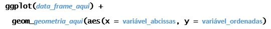
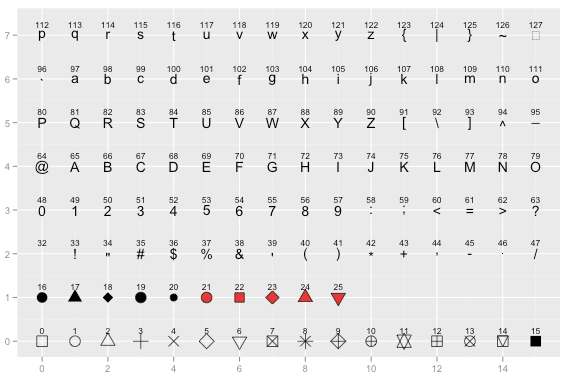
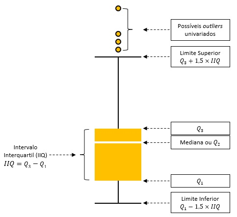

Nessa aula, daremos início a uma jornada sobre uma das capacidades mais elogiadas da linguagem R: **a construção de gráficos.** Por enquanto, trabalharemos com gráficos bidimensionais.

O R dispõe de uma ferramenta extremamente poderosa para a construção de gráficos bidimensionais: o pacote `ggplot2` (geralmente, nos referimos a ele simplesmente como ggplot.)

O pacote `ggplot2` é parte integrante do `tidyverse`.

Sim, você não leu errado: como já discutimos, o `tidyverse` é um “superpacote”, que reúne uma série de pacotes voltados aos mais diversos fins, como coleta, tratamento, organização, modelagem e visualização de dados. Você pode saber mais sobre o tidyverse clicando [aqui](https://www.tidyverse.org).

Uma vez que o `ggplot2` faz parte do `tidyverse`, podemos carregá-lo de duas formas distintas, assumindo que você já tenha instalado o `ggplot2` ou o `tidyverse` (ao instalar o `tidyverse`, o `ggplot2` já é automaticamente incluído):

```{r message=FALSE, warning=FALSE, paged.print=FALSE}
library(ggplot2)
```

Ou

```{r message=FALSE, warning=FALSE, paged.print=FALSE}
library(tidyverse)
```

Na prática, a segunda opção costuma ser mais vantajosa, pois, além do `ggplot2`, ela carrega automaticamente os principais pacotes do `tidyverse`, permitindo que você colete, manipule, organize e modele dados de forma integrada.


## A Sintaxe (Realmente) Tranquila do `ggplot2`

Uma das grandes vantagens do `tidyverse` é a sua sintaxe consistente e intuitiva. No caso do `ggplot2`, trabalharemos, na maior parte do tempo, com três elementos centrais:

1. a função `ggplot()`;

2. alguma função de geometria (*geometry*), como `geom_bar()`, `geom_histogram()` ou `geom_point()`;

3. a função `aes()`, abreviação de *aesthetic* (estética).

Esses elementos cumprem papéis bem definidos:

- `ggplot()` indica ao R que queremos construir um gráfico utilizando o pacote `ggplot2`;

- as funções de geometria (`geom_*`) definem o tipo de gráfico (barras, pontos, histogramas etc.);

- a função `aes()` especifica como as variáveis serão representadas visualmente, especialmente nos eixos x e y.

Tentando simplificar essa ideia:



Além disso, há um ponto fundamental: no `ggplot2`, os gráficos são construídos em camadas. Para isso, utilizamos o operador `+`, que permite adicionar componentes ao gráfico de forma incremental.

Em outras palavras, você não “desenha” um gráfico de uma vez; você monta o gráfico passo a passo.

Uma dica prática: experimente começar a digitar `geom_` no RStudio e observe as sugestões de autocompletar. Isso ajuda muito a explorar as diferentes possibilidades do `ggplot2`.

Por fim, recomendo que você visite este [link](https://r-graph-gallery.com/ggplot2-package.html) para visualizar um panorama das capacidades do `ggplot2`.

## Trabalhando com o `ggplot2`

Vamos começar com uma nova base de dados sobre expectativa de vida e renda na América do Sul em 2021:

```{r}
load("south_america.RData")
```


Já aprendemos que podemos utilizar a função `head()` para visualizar as primeiras observações de um conjunto de dados. No entanto, caso você queira explorar a base completa, segue abaixo a apresentação do objeto `south_america`:

```{r}
south_america
```


Na variável `country`, temos os nomes dos países da América do Sul; `pop` indica a população; `life_exp` representa a expectativa de vida média; `gdp` corresponde ao PIB *per capita*; e `mercosul` informa se o país é membro efetivo, associado ou se está suspenso do Mercosul.

Outro ponto importante: para construir gráficos com o `ggplot2`, os dados devem estar organizados em um *data frame* (ou *tibble*, que é uma versão moderna de *data frame*).

Podemos verificar isso utilizando a função `class()`:

```{r}
class(south_america)
```


Se tudo estiver correto, você deverá observar algo como `data.frame` ou `tbl_df`.

Agora, vamos começar com um dos tipos de gráfico mais importantes da análise exploratória de dados: os gráficos de dispersão, também conhecidos como *scatter plots*.

### Scatter Plots

Vamos gerar um gráfico de pontos considerando a expectativa de vida em função da renda dos países da América do Sul.

Relembrando:


Então:

```{r}
ggplot(data = south_america) +
  geom_point(aes(x = gdp, y = life_exp))
```

*Essa aí é a tal maravilhosa capacidade do R de fazer gráficos?*

<br>

Primeiramente: estamos só começando!

Segundo lugar: dê uma olhada [aqui](https://www.gapminder.org/tools/#$model$markers$bubble$encoding$trail$data$filter$markers$bra=2021;;;;;;;;&chart-type=bubbles&url=v1)

Agora, a pergunta é: você consegue imaginar que aquele gráfico foi construído com os mesmos princípios que estamos aprendendo aqui? Aliás, você sabia que esse gráfico foi feito em R com o `ggplot2`?

Esse gráfico é legal e também foi feito em R! Clique [aqui](https://lucidmanager.org/images/geography/travel-diary.png)


E aqui, um exemplo tridimensional que elaborei, indicando a quantidade de bebês nascidos com malformações congênitas em Santa Catarina. Clique [aqui](https://drive.google.com/file/d/15PAPD25-NWvPd1oGGfe9kMMYDBQhn9Tq/view?usp=sharing)

Voltando ao nosso gráfico:

```{r echo=T, error=T, eval=FALSE}
ggplot(data = south_america) +
  geom_point(aes(x = gdp, y = life_exp))
```
Vamos entender o que está acontecendo:

- `ggplot()` indica ao R que queremos construir um gráfico com o `ggplot2`;

- o argumento `data` define a base de dados utilizada;

- o operador `+` adiciona uma nova camada ao gráfico;

- `geom_point()` especifica que queremos um gráfico de dispersão;

- `aes()` define as variáveis que serão mapeadas nos eixos: `gdp` no eixo X e `life_exp` no eixo Y.

Viu? A lógica é simples e extremamente poderosa.

```{r}
ggplot(data = south_america) +
  geom_point(aes(x = gdp, y = life_exp)) +
  labs(x = "Renda",
       y = "Expectativa de Vida")
```
Começamos declarando a função `ggplot()` para dizer ao R que queremos um gráfico elaborado pelo pacote `ggplot2`. À função `ggplot()`, argumentamos `data` e apontamos nosso *data frame*. Depois, ao declarar o operador `+`, adicionamos uma nova camada ao gráfico com a função de geometria `geom_point()`, deixando claro que queremos um gráfico de pontos. Por fim, no interior da função de geometria, utilizamos `aes()` para indicar quais variáveis serão representadas nos eixos X (abcissas) e Y (ordenadas).

Viu? A sintaxe é tranquila! É só uma questão de prática!

---

**Melhorando rótulos**

Podemos tornar o gráfico mais informativo utilizando a função `labs()`:

```{r}
ggplot(data = south_america) +
  geom_point(aes(x = gdp, y = life_exp)) +
  labs(x = "Renda",
       y = "Expectativa de Vida")
```

Para a função `labs()`, argumentamos `x` para dar um novo nome ao eixo X e `y` para o eixo Y.

Também podemos adicionar um título ao gráfico, utilizando o argumento `title`:

```{r eval=FALSE}
ggplot(data = south_america) +
  geom_point(aes(x = gdp, y = life_exp)) +
  labs(x = "Renda",
       y = "Expectativa de Vida",
       title = "Renda x Expectativa de Vida na América do Sul")
```

Além disso, podemos adicionar um subtítulo com o argumento `subtitle`:
```{r eval=FALSE}
ggplot(data = south_america) +
  geom_point(aes(x = gdp, y = life_exp)) +
  labs(x = "Renda",
       y = "Expectativa de Vida",
       title = "Renda x Expectativa de Vida",
       subtitle = "América do Sul")
```
O subtítulo é útil para fornecer um contexto adicional ao gráfico, sem sobrecarregar o título principal.

A função `labs()` também permite adicionar uma legenda inferior ao gráfico por meio do argumento `caption`:
```{r}
ggplot(data = south_america) +
  geom_point(aes(x = gdp, y = life_exp)) +
  labs(x = "Renda",
       y = "Expectativa de Vida",
       title = "Renda x Expectativa de Vida",
       subtitle = "América do Sul",
       caption = "Ano de 2021")
```
O `caption` costuma ser utilizado para indicar fonte dos dados, período de análise ou observações complementares.

Melhorou, mas ainda está muito cinza, não?

---

**Adicionando cor**

Podemos alterar a cor dos pontos utilizando o argumento `color` fora do `aes()` para controlar diretamente a escolha da cor:

```{r}
ggplot(data = south_america) +
  geom_point(aes(x = gdp, y = life_exp), color = "blue") +
  labs(x = "Renda",
       y = "Expectativa de Vida",
       title = "Renda x Expectativa de Vida",
       subtitle = "América do Sul",
       caption = "Ano de 2021")
```


Para verificar as cores disponíveis no R, você pode consultar [este material](http://www.stat.columbia.edu/~tzheng/files/Rcolor.pdf). **Em geral, basta utilizar o nome da cor em inglês para que o R reconheça corretamente.**

---

**Alterando as cores:**

```{r}
ggplot(data = south_america) +
  geom_point(aes(x = gdp, y = life_exp), color = "red") +
  labs(x = "Renda",
       y = "Expectativa de Vida",
       title = "Renda x Expectativa de Vida",
       subtitle = "América do Sul",
       caption = "Ano de 2021")
```

Melhorou, mas ainda está muito cinza...

O problema está no painel de fundo do gráfico. Para modificar isso, podemos utilizar funções da família `theme()`:

```{r}
ggplot(data = south_america) +
  geom_point(aes(x = gdp, y = life_exp), color = "blue") +
  labs(x = "Renda",
       y = "Expectativa de Vida",
       title = "Renda x Expectativa de Vida",
       subtitle = "América do Sul",
       caption = "Ano de 2021") +
  theme_bw()
```

Bem melhor, certo? A função `theme_bw()` gera um fundo branco com grades discretas.

Há diversas funções da família `theme()`, inclusive em pacotes adicionais. Vale a pena explorar!

Exemplo:

```{r}
ggplot(data = south_america) +
  geom_point(aes(x = gdp, y = life_exp), color = "blue") +
  labs(x = "Renda",
       y = "Expectativa de Vida",
       title = "Renda x Expectativa de Vida",
       subtitle = "América do Sul",
       caption = "Ano de 2021") +
  theme_dark()
```

---


Agora, vamos tentar adicionar labels que identifiquem as observações no gráfico.

A função `geom_point()` controla apenas os pontos. Para adicionar textos, utilizamos outras funções de geometria, como `geom_text()` ou `geom_label()`.

Essas funções também utilizam coordenadas X e Y e exigem um argumento adicional: `label`, que indica de onde virão os textos.

- Exemplo com `geom_text()`:

```{r}
ggplot(data = south_america) +
  geom_point(aes(x = gdp, y = life_exp), color = "blue") +
  geom_text(aes(x = gdp, y = life_exp, label = country)) +
  labs(x = "Renda",
       y = "Expectativa de Vida",
       title = "Renda x Expectativa de Vida",
       subtitle = "América do Sul",
       caption = "Ano de 2021") +
  theme_bw()
```

- Exemplo com `geom_label()`:

```{r}
ggplot(data = south_america) +
  geom_point(aes(x = gdp, y = life_exp), color = "blue") +
  geom_label(aes(x = gdp, y = life_exp, label = country)) +
  labs(x = "Renda",
       y = "Expectativa de Vida",
       title = "Renda x Expectativa de Vida",
       subtitle = "América do Sul",
       caption = "Ano de 2021") +
  theme_bw()
```

Perceberam a diferença?

- `geom_text()` adiciona apenas o texto;

- `geom_label()` adiciona o texto com um fundo, visando facilitar a leitura.

Porém, acho que dá para fazer melhor! Os textos estão se sobrepondo aos pontos, e isso tira a elegância do nosso gráfico.

Vamos reposicionar e redimensionar essas *labels*.

---

**Reposicionando rótulos**

Para o reposicionamento, podemos utilizar os argumentos `hjust` (ajuste horizontal) e `vjust` (ajuste vertical). Já para o tamanho dos textos, utilizamos o argumento `size`.

```{r}
ggplot(data = south_america) +
  geom_point(aes(x = gdp, y = life_exp), color = "blue") +
  geom_text(aes(x = gdp, y = life_exp, label = country),
            vjust = -0.5,
            size = 3) +
  labs(x = "Renda",
       y = "Expectativa de Vida",
       title = "Renda x Expectativa de Vida",
       subtitle = "América do Sul",
       caption = "Ano de 2021") +
  theme_bw()
```
Pequenos ajustes como esses já melhoram bastante a legibilidade do gráfico!

Ainda assim, esse processo pode ser trabalhoso, **principalmente quando temos muitos pontos.**

Para lidar com isso de forma mais eficiente, existe um pacote chamado `ggrepel`, que reposiciona automaticamente os textos, evitando sobreposições.

Para instalá-lo:
```{r eval=FALSE}
install.packages("ggrepel")
```

E para carregá-lo:
```{r}
library(ggrepel)
```

O `ggrepel` oferece duas funções principais:

- `geom_text_repel()`;

- `geom_label_repel()`.

Essas funções funcionam de forma semelhante às que já vimos, mas com a vantagem de ajustar automaticamente a posição das *labels*.

- Exemplo com `geom_text_repel()`:
```{r}
ggplot(data = south_america) +
  geom_point(aes(x = gdp, y = life_exp), color = "blue") +
  geom_text_repel(aes(x = gdp, y = life_exp, label = country),
                  size = 3) +
  labs(x = "Renda",
       y = "Expectativa de Vida",
       title = "Renda x Expectativa de Vida",
       subtitle = "América do Sul",
       caption = "Ano de 2021") +
  theme_bw()
```

Ou, utilizando `geom_label_repel()`:

```{r}
ggplot(data = south_america) +
  geom_point(aes(x = gdp, y = life_exp), color = "hotpink1") +
  geom_label_repel(aes(x = gdp, y = life_exp, label = country),
                   size = 3) +
  labs(x = "Renda",
       y = "Expectativa de Vida",
       title = "Renda x Expectativa de Vida",
       subtitle = "América do Sul",
       caption = "Ano de 2021") +
  theme_bw()
```
Nós também podemos alterar o tamanho dos pontos do nosso gráfico utilizando o argumento `size` na função `geom_point()`:
```{r}
ggplot(data = south_america) +
  geom_point(aes(x = gdp, y = life_exp), color = "blue", size = 2.5) +
  geom_text_repel(aes(x = gdp, y = life_exp, label = country), size = 3) +
  labs(x = "Renda",
       y = "Expectativa de Vida",
       title = "Renda x Expectativa de Vida",
       subtitle = "América do Sul",
       caption = "Ano de 2021") +
  theme_bw()
```
**Aqui, todos os pontos possuem o mesmo tamanho.**

Outra possibilidade interessante do `ggplot2` é alterar o formato dos pontos com o argumento `shape`:
```{r}
ggplot(data = south_america) +
  geom_point(aes(x = gdp, y = life_exp), color = "blue", size = 2.5, shape = 15) +
  geom_text_repel(aes(x = gdp, y = life_exp, label = country), size = 3) +
  labs(x = "Renda",
       y = "Expectativa de Vida",
       title = "Renda x Expectativa de Vida",
       subtitle = "América do Sul",
       caption = "Ano de 2021") +
  theme_bw()
```
O argumento `shape` define o formato dos pontos (quadrado, círculo, triângulo, etc.).

Segue uma lista interessante de shapes:



**Também é possível alterar o tamanho dos pontos em função de outra variável. Vamos fazer isso utilizando a variável `pop`.**

---

**Estética Fixa *versus* Estética Mapeada**


Porém, antes, um ponto muito, MUITO, importante!

Vocês viram que a função `aes()` vem de *aesthetic* (estética), certo?

Até agora, usamos `aes()` apenas para definir as posições dos pontos (eixos X e Y). Já características visuais, como cor, tamanho e formato, foram definidas fora da função `aes()`, diretamente na geometria.

**Isso significa que todos os pontos receberam exatamente o mesmo valor para essas características.**

**Agora vem a ideia central:**

- Quando colocamos um argumento dentro da função `aes()`, estamos dizendo ao R que aquela característica visual deve variar de acordo com uma variável da base de dados. Esse recurso é chamado de **estética mapeada.**

- Quando colocamos fora da função `aes()`, estamos arbitrando um valor fixo. Essa abordagem é chamada de **estética fixa.**

Vamos ver isso na prática:

```{r}
ggplot(data = south_america) +
  geom_point(aes(x = gdp,
                 y = life_exp,
                 size = pop),
             color = "blue") +
  geom_text_repel(aes(x = gdp, y = life_exp, label = country), size = 3) +
  labs(x = "Renda",
       y = "Expectativa de Vida",
       title = "Renda x Expectativa de Vida",
       subtitle = "América do Sul",
       caption = "Ano de 2021") +
  theme_bw()
```
Agora, o tamanho dos pontos varia de acordo com a população de cada país, perceberam?

```{r message=FALSE, warning=FALSE, include=FALSE, paged.print=FALSE}
scale_colour_discrete <- function(...) {
  scale_colour_brewer(palette = "Set2")
}

scale_fill_discrete <- function(...) {
  scale_fill_brewer(palette = "Set2")
}
```


De forma análoga, podemos colorir nossos pontos em função de uma variável categórica. Vamos tentar utilizando a variável `mercosul`:
```{r}
ggplot(data = south_america) +
  geom_point(aes(x = gdp, y = life_exp, size = pop, color = mercosul)) +
  geom_text_repel(aes(x = gdp, y = life_exp, label = country), size = 3) +
  labs(x = "Renda",
       y = "Expectativa de Vida",
       title = "Renda x Expectativa de Vida",
       subtitle = "América do Sul",
       caption = "Ano de 2021") +
  theme_bw()
```

Agora, além da posição dos pontos, conseguimos visualizar:

- o tamanho de cada ponto: faixas populacionais;

- a cor: *status* de cada país no Mercosul

Noutras palavras, começamos a extrair mais informação do mesmo gráfico!

*Legal, mas a legenda ainda não está lá essas coisas, né?*

---

**Trabalhando com legendas**

Quando utilizamos argumentos como size e color dentro da função `aes()`, o `ggplot2` automaticamente cria legendas para essas características.

E aqui vem o ponto importante: **Podemos renomear essas legendas utilizando a própria função `labs()`.**

O que isso significa, na prática?

- Se utilizamos `size` dentro do `aes()`, podemos usar `size` dentro do `labs()` para renomear essa legenda.

- Se utilizamos `color` dentro do `aes()`, podemos usar color dentro do `labs()`.

Exemplo:
```{r}
ggplot(data = south_america) +
  geom_point(aes(x = gdp, y = life_exp, size = pop, color = mercosul)) +
  geom_text_repel(aes(x = gdp, y = life_exp, label = country), size = 3) +
  labs(x = "Renda",
       y = "Expectativa de Vida",
       title = "Renda x Expectativa de Vida",
       subtitle = "América do Sul",
       caption = "Ano de 2021",
       size = "População",
       color = "Status no Mercosul") +
  theme_bw()
```

Agora sim, muito mais informativo e profissional.

A seguir, vamos conversar sobre o gráfico de linhas.

### Gráfico de Linhas

Para os gráficos de linhas, vamos utilizar dois datasets que indicam os casos e as mortes por Covid-19 na cidade de São Paulo. Os dados foram obtidos do repositório [Brasil.IO](https://brasil.io/home/).
```{r}
load("covid_saopaulo.RData")
```

Assim estão dispostos os dados no objeto `casos_saopaulo`:
```{r}
casos_saopaulo
```
E assim estão dispostos os dados no objeto `mortes_saopaulo`:
```{r}
mortes_saopaulo
```

Em ambos os datasets, a variável `t` representa o tempo (em dias) desde o primeiro registro oficial.

- No objeto `casos_saopaulo`, `t` indica os dias desde o primeiro caso confirmado;

No objeto `mortes_saopaulo`, `t` indica os dias desde o primeiro óbito registrado.

Diferente do gráfico de dispersão, o gráfico de linhas é utilizado quando queremos observar a evolução de uma variável ao longo do tempo, ou seja, **os pontos são conectados para mostrar uma trajetória.**

Vamos elaborar, inicialmente, um gráfico de linhas para observar o comportamento da Covid-19 em São Paulo, utilizando a variável `casos_cumulativos`:

```{r}
ggplot(data = casos_saopaulo) +
  geom_line(aes(x = t, y = casos_cumulativos))
```

Bom, pessoal... Daqui por diante, a lógica é a mesma que já vimos. Vamos apenas melhorar a apresentação do gráfico:

```{r}
ggplot(data = casos_saopaulo) +
  geom_line(aes(x = t, y = casos_cumulativos),
            color = "#4f9c9e",
            linewidth = 1.2) +
  labs(x = "Dias desde a primeira notificação oficial",
       y = "Casos cumulativos",
       title = "Comportamento da Covid-19",
       subtitle = "São Paulo/SP") +
  theme_bw()
```
Agora, vamos mudar um pouco a abordagem: **e se quisermos analisar o comportamento dos óbitos ao longo do tempo, mas sem considerar o acumulado?**

```{r}
ggplot(data = mortes_saopaulo) +
  geom_line(aes(x = t, y = mortes))
```
Aqui, cada ponto representa o número de mortes em um determinado dia.

Tentando dar maior elegância ao gráfico:
```{r}
ggplot(data = mortes_saopaulo) +
  geom_line(aes(x = t, y = mortes),
            color = "#1b255d",
            linewidth = 0.5) +
  labs(x = "Dias desde a primeira notificação oficial",
       y = "Mortes por dia",
       title = "Comportamento da Covid-19",
       subtitle = "São Paulo/SP") +
  theme_bw()
```

A maior dificuldade na construção de gráficos de linhas com o `ggplot2`, na minha opinião, surge quando queremos representar uma linha para cada grupo da análise.

Por exemplo, quando desejamos comparar o comportamento da Covid-19 em diferentes países, em um mesmo gráfico.

---


Para ilustrar esse problema, vamos carregar uma nova base de dados com informações sobre a Covid-19 no Brasil, EUA, Reino Unido e China:

```{r}
load("covid_mundo.RData")
```

Apresentando a base:
```{r}
covid_mundo
```

Observe que a variável *country* contém quatro países distintos.

Agora, vamos tentar construir um gráfico de linhas da forma como aprendemos até aqui:
```{r}
ggplot(data = covid_mundo) +
  geom_line(aes(x = t, y = cumulative_cases))

```

O resultado não será o esperado, porque o `ggplot2` **não sabe que queremos uma linha para cada país.** Então ele conecta todos os pontos como se fossem de um único grupo.

Resultado: uma linha confusa, misturando países diferentes.

Para resolver isso, precisamos dizer ao R como os dados devem ser agrupados. Para isso, utilizamos o argumento `group`:

```{r}
ggplot(data = covid_mundo) +
  geom_line(aes(x = t, y = cumulative_cases, group = country))

```
Agora sim, temos uma linha para cada país.


Podemos tornar o gráfico mais informativo utilizando cores diferentes para cada país:

```{r}
ggplot(data = covid_mundo) +
  geom_line(aes(x = t, y = cumulative_cases, group = country, color = country), linewidth = 1.2) +
  labs(x = "Transcorrer temporal em dias desde a primeira notificação oficial",
       y = "Casos Cumulativos",
       title = "Comportamento da Covid-19",
       subtitle = "Mundo",
       color = "Países") +
  theme_bw()
```
Agora, além de separar as linhas, conseguimos identificar cada país de forma clara.

### Histograma

A função de geometria para a construção de histogramas é a `geom_histogram()`.

Desta vez, vamos utilizar uma base de dados interna do R chamada `warpbreaks`. Essa base trata do número de rompimentos em fios de lã sob diferentes condições de tensão.

A base `warpbreaks` foi amplamente utilizada em estudos entre as décadas de 1950 e 1970. Para mais detalhes, você pode consultar:
```{r eval=FALSE}
?warpbreaks
```

Carregando a base:

```{r}
data("warpbreaks")
```

Vamos visualizar os dados:
```{r}
warpbreaks
```
- A variável *breaks* indica a quantidade de rompimentos dos fios de lã;
- a variável *wool* identifica o tipo de lã (*A* ou *B*);
- e a variável *tension* representa o nível de tensão aplicado (*L* = baixo, *M* = médio, *H* = alto).

Vocês concordariam se eu dissesse que, para construir um histograma, não faz sentido declarar o argumento `y` dentro da função `aes()`?

Isso ocorre porque o histograma não utiliza diretamente uma variável no eixo Y. Ele calcula automaticamente a frequência (ou contagem) das observações.

Observe:

```{r}
ggplot(data = warpbreaks) +
  geom_histogram(aes(x = breaks))
```

Viram?

Vocês poderiam dizer: *Ok… mas além de pouco atrativo, o gráfico apresenta espaçamentos estranhos... e o R ainda exibiu um warning.*


Vamos por partes.

Primeiro, o *warning*:

```{r eval=FALSE}
stat_bin() using bins = 30. Pick better value with binwidth.
```

Essa mensagem indica que você não informou ao R quantas classes (ou “caixas”) deseja no histograma. **Por padrão, o R utiliza 30.**

Podemos ajustar isso com o argumento bins:

```{r}
ggplot(data = warpbreaks) +
  geom_histogram(aes(x = breaks), bins = 5)
```

---

**Atenção:**

O número de `bins` influencia diretamente a interpretação do gráfico.

- poucos bins: visão mais geral;
- muitos bins: mais detalhamento.

Não existe um valor “correto” universal. Isso é uma escolha analítica.

---


**Para colorir é fácil, certo? Basta usar o argumento `color`, não é?**

*ERRADO!*

<br>

O argumento `color` altera apenas a cor das bordas das barras. Para preencher as barras, devemos utilizar o argumento `fill`.

```{r}
ggplot(data = warpbreaks) +
  geom_histogram(aes(x = breaks),
                 bins = 5,
                 color = "#003a95",
                 fill = "#7561b8")
```

Dando mais elegância ao nosso histograma:

```{r}
ggplot(data = warpbreaks) +
  geom_histogram(aes(x = breaks),
                 bins = 5,
                 color = "#003a95",
                 fill = "#7561b8") +
  labs(x = "Quebras dos fios de lã",
       y = "Contagem",
       title = "Distribuição das quebras no dataset warpbreaks") +
  theme_minimal()
```


### Gráfico de Barras

Vamos tentar um novo tipo de gráfico: **o gráfico de barras.** Logo, a função de geometria será a função `geom_bar()`.

Para esse tipo de gráfico, vamos utilizar uma base de dados sobre as escolaridades de 100 pretendentes a vagas em alguma empresa:
```{r}
load("vagas_rh.RData")
```

Apresentando a base de dados `vagas_rh`:
```{r}
vagas_rh
```

A base de dados `vagas_rh` possui duas variáveis: `candidato` e `escolaridade`.

O desafio será gerar um gráfico de barras que aponte quantas vezes as categorias da variável `escolaridade` se repetem. Se não precisássemos de um gráfico, poderíamos verificar essa situação com o auxílio da função `summary()`:
```{r}
summary(vagas_rh)
```

Nosso gráfico pode ser construído da seguinte maneira:

```{r}
ggplot(data = vagas_rh) +
  geom_bar(aes(x = escolaridade))
```

*Cadê o argumento do eixo das ordenadas?*

<br>

Pessoal, um gráfico de barras **(não confundir com o de colunas)** serve para apresentar variáveis categóricas. Nesse sentido, a função `geom_bar()` é inteligente o suficiente para contar automaticamente quantas vezes cada categoria aparece, dispensando, *a priori*, a declaração do argumento `y` da função `aes()`.

Em outras palavras, o próprio `ggplot2` constrói o eixo Y para nós, representando a contagem das categorias.

Vamos deixar o gráfico mais bonito?
```{r}
ggplot(data = vagas_rh) +
  geom_bar(aes(x = escolaridade),
           color = "#1c3d52",
           fill = "#51acc5")
```

Para alterar o nome dos eixos, devemos voltar a utilizar a função `labs()`:
```{r}
ggplot(data = vagas_rh) +
  geom_bar(aes(x = escolaridade),
           color = "#1c3d52",
           fill = "#51acc5") +
  labs(x = "Escolaridade",
       y = "Contagem")
```

Para mudar o painel de fundo do gráfico, devemos utilizar alguma função `theme()`:
```{r}
ggplot(data = vagas_rh) +
  geom_bar(aes(x = escolaridade),
           color = "#1c3d52",
           fill = "#51acc5") +
  labs(x = "Escolaridade",
       y = "Contagem") +
  theme_light()
```

Para adicionar *labels* de contagem das frequências das categorias da variável `escolaridade`, a coisa começa a ficar estranha...

*Começa a ficar estranha? COMEÇA?*

<br>

Gente, aqui é na base do aceita que dói menos. Vou tentar suavizar, mas, no fim do dia, a conclusão é que a sintaxe utilizada faz parte das maluquices do R.

Porém, antes do código, vamos entender o que está acontecendo.

Nós não temos uma variável pronta que conte quantos candidatos fazem parte de cada estrato de escolarização. Quem faz essa contagem é o próprio `ggplot2`.

Assim, quando queremos exibir essa contagem no gráfico, precisamos acessar esse valor calculado internamente.

Para isso, declaramos `label = after_stat(count)` na função `aes()`.

<br>

*Só isso, NÉ?*

<br>

Então...

Tem só mais uma coisinha...


Já que estamos pedindo ao `geom_text()` para mostrar uma contagem, precisamos garantir que ele utilize o mesmo tipo de cálculo do `geom_bar()`. Por isso, declaramos `stat = "count"`.

```{r}
ggplot(data = vagas_rh) +
  geom_bar(aes(x = escolaridade),
           color = "#1c3d52",
           fill = "#51acc5") +
  geom_text(aes(x = escolaridade,
                label = after_stat(count)),
            stat = "count") +
  labs(x = "Escolaridade",
       y = "Contagem") +
  theme_light()
```

<br>

*Rafa, existem outras declarações bizarras com o `stat` e o `label`?*

<br>

Meu pequeno gafanhoto e minha pequena gafanhota, digamos que seu tempo aqui comigo será considerado como atenuante no dia do Juízo Final.

E enquanto esse dia não vem, bora arrumar o gráfico, porque as labels ficaram deslocadas! Lembram-se dos argumentos `vjust` e `hjust`?

```{r}
ggplot(data = vagas_rh) +
  geom_bar(aes(x = escolaridade),
           color = "#1c3d52",
           fill = "#51acc5") +
  geom_text(aes(x = escolaridade,
                label = after_stat(count)),
            stat = "count",
            vjust = -0.5) +
  labs(x = "Escolaridade",
       y = "Contagem") +
  theme_light()
```

---

Ainda sobre os gráficos de barras, vou propor uma nova base de dados em que seja possível a estratificação das observações, isto é, o estudo de grupos de indivíduos:
```{r}
load("vagas_rh_grupo.RData")
```

Vamos observar o objeto `vagas_rh_grupo`:
```{r}
vagas_rh_grupo
```

O dataset `vagas_rh_grupo` é, de fato, semelhante à base de dados `vagas_rh`. Porém, agora há uma coluna adicional com dados categóricos: a variável `sexo`.

De acordo com o que aprendemos até aqui, poderíamos propor o seguinte gráfico de barras a respeito da escolarização dos candidatos:
```{r}
ggplot(data = vagas_rh_grupo) +
  geom_bar(aes(x = escolaridade),
           color = "#802b5b",
           fill = "#fea775") +
  geom_text(aes(x = escolaridade,
                label = after_stat(count)),
            stat = "count",
            vjust = -0.5) +
  labs(x = "Escolaridade",
       y = "Contagem") +
  theme_light()
```

Até aqui, nenhuma novidade, certo?

E se quiséssemos um gráfico de barras que apresentasse as informações a respeito dos candidatos, mas que os estratificasse em razão de seus sexos biológicos?

**Aqui há, pelo menos, três alternativas interessantes. Vamos começar pela mais simples: a função `facet_wrap()`.**

A função `facet_wrap()` atua em conjunto com as geometrias que geram os gráficos. Ela propõe a estratificação das observações, gerando painéis distintos para cada grupo. Notem:
```{r}
ggplot(data = vagas_rh_grupo) +
  geom_bar(aes(x = escolaridade),
           color = "#802b5b",
           fill = "#fea775") +
  geom_text(aes(x = escolaridade,
                label = after_stat(count)),
            stat = "count",
            vjust = -0.5) +
  labs(x = "Escolaridade",
       y = "Contagem") +
  facet_wrap(~ sexo) +
  theme_light()
```
Ao argumento `facets`, da função `facet_wrap()`, declaramos `~ sexo`. Por quê?

Porque, em geral, o operador `~`, na linguagem R, assume o significado de "em função de". Assim, o `ggplot2` entende que deve gerar painéis gráficos com as observações estratificadas em função da variável `sexo`.

Com a função `facet_wrap()`, poderíamos propor um gráfico que fosse o oposto do último, isto é, que apresentasse os candidatos em função de seus sexos biológicos, mas que os estratificasse em função de suas escolaridades:
```{r}
ggplot(data = vagas_rh_grupo) +
  geom_bar(aes(x = sexo),
           color = "#260b2c",
           fill = "#d46059") +
  geom_text(aes(x = sexo,
                label = after_stat(count)),
            stat = "count",
            vjust = -0.5) +
  labs(x = "Sexo Biológico",
       y = "Contagem") +
  facet_wrap(~ escolaridade) +
  theme_light()
```
Legal, né?

Só que pode ser que vocês não queiram painéis. Talvez um gráfico de barras único, contendo estratificações, faça mais sentido. Aqui, nós teremos que mudar as nossas declarações de uma forma mais brusca. Assim, vou apresentar o gráfico final e, depois, discutir essas alterações:

```{r}
ggplot(data = vagas_rh_grupo) +
  geom_bar(aes(x = escolaridade,
               group = sexo,
               fill = sexo),
           position = position_dodge(width = 0.9),
           color = "white") +
  geom_text(aes(x = escolaridade,
                label = after_stat(count),
                group = sexo),
            stat = "count",
            position = position_dodge(width = 0.9),
            vjust = -0.5) +
  labs(x = "Escolaridade",
       y = "Contagem",
       fill = "Sexo Biológico") +
  theme_light()
```
Vocês já devem ter imaginado que utilizaríamos o argumento `group`, nesse caso. Também devem ter previsto que transportaríamos o argumento `fill` para o interior da função `aes()`.

Só que vamos precisar de um novo argumento a ser declarado, concomitantemente, às duas funções de geometria que estamos utilizando no momento: o argumento `positio`n.

A chatice é que o argumento position precisa ser declarado de forma consistente nas duas geometrias (`geom_bar()` e `geom_text()`).

No caso da função `geom_bar()`, declaramos `position = position_dodge()`. É justamente essa declaração que gera as barras lado a lado, em relação aos diferentes grupos dos dados.

Para a função `geom_text()`, também utilizamos `position_dodge()`, com o mesmo valor de `width`, para garantir que os rótulos fiquem alinhados com as barras correspondentes.

Por fim, já que transportamos o argumento `fill` para o interior da função `aes()`, abre-se a possibilidade de utilizarmos `fill` na função `labs()` para ajustar a legenda.

<br>

*Rafa, eu quero mais espaçamento entre as barras!*

<br>

No lugar da função `position_dodge()`, basta utilizar a função `position_dodge2()`:
```{r}
ggplot(data = vagas_rh_grupo) +
  geom_bar(aes(x = escolaridade,
               group = sexo,
               fill = sexo),
           position = position_dodge2(),
           color = "white") +
  geom_text(aes(x = escolaridade,
                label = after_stat(count),
                group = sexo),
            stat = "count",
            position = position_dodge2(width = 1),
            vjust = -0.5) +
  labs(x = "Escolaridade",
       y = "Contagem",
       fill = "Sexo Biológico") +
  theme_light()
```

---

Para um gráfico em que as barras indiquem as escolaridades e as cores indiquem os sexos biológicos, podemos comandar:
```{r}
ggplot(data = vagas_rh_grupo) +
  geom_bar(aes(x = sexo,
               group = escolaridade,
               fill = escolaridade),
           position = position_dodge2(),
           color = "white") +
  geom_text(aes(x = sexo,
                label = after_stat(count),
                group = escolaridade),
            stat = "count",
            position = position_dodge2(width = 1),
            vjust = -0.5) +
  labs(x = "Sexo Biológico",
       y = "Contagem",
       fill = "Escolaridade") +
  theme_light()
```

---

Por outro lado, pode ser que um gráfico de barras empilhadas faça mais sentido. De novo, haverá uma sensível alteração das rotinas e, de novo, apresentarei o gráfico antes das devidas explicações.

```{r}
ggplot(data = vagas_rh_grupo) +
  geom_bar(aes(x = escolaridade,
               fill = sexo),
           position = position_stack(),
           color = "white") +
  geom_text(aes(x = escolaridade,
                label = after_stat(count),
                group = sexo),
            stat = "count",
            position = position_stack(vjust = 0.5)) +
  labs(x = "Escolaridade",
       y = "Contagem",
       fill = "Sexo Biológico") +
  theme_light()
```
De cara, o argumento `group` não é necessário quando queremos barras empilhadas. Sim, eu sei que, em última análise, estamos agrupando observações. Coisas do R...

Depois, o que muda são as declarações para o argumento `position`, a depender da função de geometria. Para a função `geom_bar()`, declaramos `position = "stack`" para o R entender que desejamos um gráfico de barras empilhadas.

Já para a função `geom_text()`, declaramos `position = position_stack(vjust = 0.5)` para indicar que as *labels* deverão se posicionar em função do empilhamento das barras. O argumento `vjust = 0.5` indica que o posicionamento será feito aproximadamente no centro de cada segmento da barra.

<br>

*Como diriam os Beatles: HELP!*

<br>

Sim, eu sei que é MUITA informação! Só há uma saída: praticar! Busquem bases de dados e comecem a gerar gráficos até a ficha cair.

Segue um outro gráfico em que as barras empilhadas indicam as escolaridades, e as cores indicam os sexos biológicos:
```{r}
ggplot(data = vagas_rh_grupo) +
  geom_bar(aes(x = sexo,
               fill = escolaridade),
           position = "stack",
           color = "white") +
  geom_text(aes(x = sexo,
                label = after_stat(count),
                group = escolaridade),
            stat = "count",
            position = position_stack(vjust = 0.5)) +
  labs(x = "Sexo Biológico",
       y = "Contagem",
       fill = "Escolaridade") +
  theme_light()
```

Antes de seguirmos para o gráfico de colunas, vale a pena dar um passo atrás e observar o que construímos até aqui.

Com o gráfico de barras, aprendemos a trabalhar com variáveis categóricas, entendendo como o `ggplot2` realiza contagens automaticamente e como podemos representar essas informações visualmente.

Além disso, avançamos para situações mais realistas, nas quais:

- analisamos distribuições gerais;
- estratificamos dados por grupos (com `facet_wrap()`);
- comparamos grupos em um único gráfico (com `position_dodge()`);
- e empilhamos informações para observar composições (com `position = "stack"`).

Cada uma dessas abordagens responde a perguntas diferentes, e essa é a parte mais importante! **Não existe um único gráfico “correto”. Existe o gráfico que melhor responde à pergunta que você quer fazer aos dados.**


Se algo pareceu confuso em algum momento, é absolutamente normal. Esse é, provavelmente, o ponto da aula em que mais coisas novas aparecem ao mesmo tempo.

A recomendação é simples: pratiquem. Troquem variáveis, testem combinações, quebrem os gráficos e refaçam. É assim que a lógica começa a fazer sentido.

Agora sim, bora para o gráfico de colunas.

### Gráfico de Colunas

Para o gráfico de colunas, utilizaremos a função de geometria `geom_col()`.

A primeira dúvida que vai surgir é: *Cara, qual a diferença entre um gráfico de barras e um gráfico de colunas?*

Se você formulou sua dúvida dessa maneira, minha resposta será que não há diferença conceitual entre eles.

Por outro lado, se a sua pergunta for: Qual a diferença entre a utilização da `geom_bar()` e da `geom_col()`?, então teremos assunto!

Nós utilizamos as bases de dados `vagas_rh` e `vagas_rh_grupo`, certo? Vocês notaram que, nesses objetos, não há uma variável de contagem de ocorrência de cada caso? Noutras palavras, as categorias estão presentes, mas não há uma variável numérica que represente suas frequências. posto de outra forma, não há um argumento `y` para ser declarado na função `aes()`.

Nessas situações, quando desejamos construir um gráfico de barras, utilizamos a função `geom_bar()`, que realiza a contagem automaticamente.

**Por outro lado, quando já existe uma coluna que representa a contagem (ou qualquer outra medida numérica), e queremos utilizá-la diretamente no gráfico, a função adequada é a `geom_col()`.**

Vamos carregar a base de dados para esse novo cenário, que representa a sumarização dos dados observados no objeto `vagas_rh`:

```{r}
load("vagas_rh_totais.RData")
```


Observem os novos dados presentes no objeto `vagas_rh_totais`:

```{r}
vagas_rh_totais
```


Perceberam a diferença entre os objetos `vagas_rh` (utilizado no exemplo do gráfico de barras) e o objeto `vagas_rh_totais` (que será utilizado para os gráficos de colunas)?

No objeto `vagas_rh_totais` existe uma coluna numérica (`n`), que poderá ser utilizada como argumento `y` na função `aes()`!

Logo, a criação de um gráfico de colunas é bem mais tranquila! Notem a declaração necessária para a construção de um gráfico que indica a quantidade de candidatos em função de suas escolaridades:
```{r}
ggplot(data = vagas_rh_totais) +
  geom_col(aes(x = escolaridade, y = n),
           color = "#1eccea",
           fill = "#ec6d7a") +
  geom_label(aes(x = escolaridade, y = n, label = n),
             size = 4,
             vjust = 1.2,
             color = "black",
             fill = "gray95",
             fontface = "bold") +
  labs(x = "Escolaridade",
       y = "Contagem") + 
  theme_test()
```

A novidade do gráfico anterior diz respeito ao argumento `fontface = "bold"` na função `geom_label()` (também poderia ser utilizado em `geom_text()`). Esse comando deixa o texto das *labels* em negrito; já `fontface = "italic"` produz o efeito em itálico.

Caso vocês queiram que as colunas fiquem dispostas na horizontal, basta utilizar a função `coord_flip()`:
```{r}
ggplot(data = vagas_rh_totais) +
  geom_col(aes(x = escolaridade, y = n),
           color = "#1eccea",
           fill = "#ec6d7a") +
  geom_label(aes(x = escolaridade, y = n, label = n),
             size = 4,
             hjust = 1.2,
             color = "black",
             fill = "gray95",
             fontface = "bold") +
  labs(x = "Escolaridade",
       y = "Contagem") + 
  coord_flip() +
  theme_test()
```

Fácil, certo?

---

Deixa eu mostrar uma peculiaridade da função `geom_col()` que facilita, e muito, a vida!

Vamos carregar uma nova base de dados que é a sumarização do objeto `vagas_rh_grupo`:

```{r}
load("vagas_rh_grupo_totais.RData")
```


Apresentando o objeto `vagas_rh_grupo_totais`:
```{r}
vagas_rh_grupo_totais
```

Agora, vamos gerar, mais uma vez, um gráfico que indica a quantidade de candidatos em função de suas escolaridades, porém, utilizando o objeto `vagas_rh_grupo_totais`:
```{r}
ggplot(data = vagas_rh_grupo_totais) +
  geom_col(aes(x = escolaridade, y = n),
           color = "#d10055",
           fill = "#d10055") +
  labs(x = "Escolaridade",
       y = "Contagem") + 
  theme_bw()
```

*Beleza! Cadê a tal peculiaridade que ajuda?*

<br>

**Pessoal, eu colori as bordas e o preenchimento do gráfico com a mesma cor pela primeira vez, e tem um motivo! Vamos mudar um desses argumentos:**

Pessoal, eu colori as bordas e o preenchimento do gráfico com a mesma cor pela primeira vez, e tem um motivo! Vamos mudar um desses argumentos:
```{r}
ggplot(data = vagas_rh_grupo_totais) +
  geom_col(aes(x = escolaridade, y = n),
           color = "#d10055",
           fill = "cornsilk2") +
  labs(x = "Escolaridade",
       y = "Contagem") + 
  theme_bw()
```
*Que bruxaria é essa? Se estivéssemos na Idade Média, esse seria um belo dia para acender uma fogueira! Cadê a declaração da variável `sexo`?*

<br>

Né? Vamos melhorar esse gráfico:
```{r}
ggplot(data = vagas_rh_grupo_totais) +
  geom_col(aes(x = escolaridade, y = n),
           color = "#6c0000",
           fill = "#d10055") +
  geom_text(aes(x = escolaridade, y = n, label = n),
            position = position_stack(vjust = 0.5)) +
  labs(x = "Escolaridade",
       y = "Contagem") + 
  theme_bw()
```
A função `geom_col()` costuma reconhecer agrupamentos quando eles já estão presentes nos dados. Porém, essa “inteligência” é limitada. 

De novo:
```{r}
vagas_rh_grupo_totais
```

Para garantir que as *labels* sejam plotadas corretamente, é necessário explicitar o agrupamento com o argumento `group`. Além disso, para diferenciar visualmente os grupos, devemos declarar o argumento `fill` dentro da função `aes()`:
```{r}
ggplot(data = vagas_rh_grupo_totais) +
  geom_col(aes(x = escolaridade,
               y = n,
               fill = sexo,
               group = sexo),
           color = "white") +
  geom_text(aes(x = escolaridade,
                y = n,
                label = n,
                group = sexo),
            position = position_stack(vjust = 0.5)) +
  labs(x = "Escolaridade",
       y = "Contagem",
       fill = "Sexo Biológico") +
  theme_bw()
```

Antes de seguirmos, vale a pena consolidar o que fizemos até aqui com gráficos de barras e colunas.

Trabalhamos com diferentes formas de representar variáveis categóricas, seja por meio de contagens automáticas (`geom_bar()`), seja utilizando valores já previamente agregados (`geom_col()`).

Além disso, vimos como enriquecer esses gráficos ao:

- adicionar *labels*;
- estratificar dados com `facet_wrap()`;
- comparar grupos no mesmo gráfico (`position_dodge()`);
- e analisar composições com barras empilhadas (`position = "stack"`).

Percebam que, apesar de parecer muita coisa, a lógica é sempre a mesma: definir o que vai para o eixo X, o que vai para o eixo Y (quando necessário) e como queremos organizar visualmente os dados.

Agora, vamos mudar um pouco o foco.

Até aqui, trabalhamos essencialmente com variáveis categóricas. A partir de agora, vamos explorar um tipo de gráfico voltado para variáveis numéricas e suas distribuições.

Bora para o *boxplot*.


### *Boxplot*

A função de geometria para a construção de um *boxplot* é a função `geom_boxplot()`.

O *boxplot* é uma ferramenta interessante que fornece boas indicações sobre a distribuição dos nossos dados, bem como sobre a presença de possíveis *outliers*.

<br>



Para ter acesso às medidas de $Q_{1}$ e $Q_{3}$ no R, podemos utilizar a função `summary()`. Porém, antes, vamos abrir uma base de dados:

```{r}
load("dados_alunos.RData")
```


A base de dados `dados_alunos` possui informações sobre alguns acadêmicos e suas rendas familiares mensais:

```{r}
dados_alunos
```


Antes de gerar um *boxplot* da variável `renda_familiar`, do objeto `dados_alunos`, vamos observar o resultado da aplicação da função `summary()`:

```{r}
summary(dados_alunos)
```


A função `summary()`, no caso de variáveis métricas, retorna as principais estatísticas descritivas univariadas daquela coluna:

- `Min.`: indica o valor mínimo presente na variável;
- `1st Qu.`: aponta o valor do primeiro quartil ($Q_{1}$);
- `Median`: discrimina o valor da mediana ($Md$ ou $Q_{2}$);
- `Mean`: apresenta o valor da média aritmética;
- `3rd Qu.`: demonstra o valor do terceiro quartil ($Q_{3}$);
- `Max.`: representa o valor máximo presente na variável.

---

Uma outra maneira de extrair os quantis (no caso, os quartis: $Q_{i}, i = 1,2,3,4$) é com a função `quantile()`:

```{r}
quantile(x = dados_alunos$renda_familiar,
         probs = seq(from = 0,
                     to = 1,
                     by = 0.25))
```

Para a função `quantile()`, temos os seguintes argumentos:

- `x`: variável métrica de interesse;

Quanto ao argumento `probs`, vamos por partes.

Ali, utilizei a função `seq()`, que serve para gerar sequências no R. Os quantis indicam, em termos percentuais, como os dados estão distribuídos.

Por exemplo:

- $Q_{1}$ representa o valor abaixo do qual estão 25% das observações;
- $Q_{2}$ (mediana) representa 50%;
- $Q_{3}$ representa 75%.

Assim, na função `seq()`, geramos uma sequência de 0 a 1 `(from = 0, to = 1)`, com incrementos de 0.25 `(by = 0.25)`, pois estamos interessados nos quartis, que dividem a base em quatro partes iguais ($\frac{1}{4} = 0.25$).

Dito isso, podemos construir nosso *boxplot*:

```{r}
ggplot(data = dados_alunos) +
  geom_boxplot(aes(x = renda_familiar),
               color = "#ff00a0",
               fill = "#ffa059") +
  labs(x = "Renda Familiar Mensal") +
  theme_minimal()
```


Sabemos que a função `coord_flip()` rotaciona os gráficos, certo?

```{r}
ggplot(data = dados_alunos) +
  geom_boxplot(aes(x = renda_familiar),
               color = "#ff00a0",
               fill = "#ffa059") +
  labs(x = "Renda Familiar Mensal") +
  coord_flip() +
  theme_minimal()
```


Se vocês ainda não entenderam onde se encontram todas as observações consideradas pelo *boxplot*, segue um gráfico didático **(gentileza: não utilizar a rotina a seguir em nenhum tipo de trabalho)**:

```{r}
ggplot(data = dados_alunos) +
  geom_boxplot(aes(x = renda_familiar),
               color = "#ff00a0",
               fill = "#ffa059") +
  geom_point(aes(x = renda_familiar, y = 0),
             alpha = 0.2) +
  labs(x = "Renda Familiar Mensal",
       y = NULL) +
  coord_flip() +
  theme(panel.background = element_rect(fill = "white", color = "black"),
        panel.grid = element_line(color = "grey85"),
        panel.border = element_rect(fill = NA, color = "black"),
        axis.text.x = element_blank(),
        axis.ticks.x = element_blank())
```

Com isso, encerramos a construção de *boxplots*.

Ao longo desse tópico, vimos como essa ferramenta resume a distribuição de uma variável de forma bastante eficiente, destacando:

- posição central dos dados (mediana);
- dispersão (quartis);
- e possíveis valores extremos (*outliers*).

Além disso, utilizamos recursos visuais simples, como rotação do gráfico e ajuste de transparência, para tornar a interpretação mais clara.

Como em todos os gráficos que vimos até aqui, o mais importante não é apenas saber construir o *boxplot*, mas entender o que ele está comunicando.

A partir daqui, avançaremos para um tema que vai além da estética: a acessibilidade na visualização de dados, em especial para pessoas com daltonismo.


## Preocupações com a Inclusão de Indivíduos Daltônicos

Pessoal, segundo o Conselho Federal de Medicina, o daltonismo atinge, em média, cerca de 5% da população mundial; no Brasil, estima-se que aproximadamente 7% da população seja daltônica.

O daltonismo é uma condição que impede que determinada pessoa enxergue a mesma variedade de cores que a maioria de nós percebe. Não sei por quê, mas é comum escutarmos duas ideias equivocadas a respeito:

a) que pessoas daltônicas têm dificuldades apenas com as cores verde e vermelho;
b) que apenas indivíduos do sexo masculino podem ser daltônicos.

A maioria das pessoas daltônicas, de fato, apresenta dificuldade considerável, muitas vezes intransponível, em distinguir o verde do vermelho. Porém, há situações em que as cores afetadas incluem também o azul e o amarelo. Em casos mais raros, ocorre a visão acromática, na qual a pessoa enxerga apenas tons de branco, cinza e preto.

Outro ponto interessante é que o gene associado ao daltonismo está, na maioria dos casos, ligado ao cromossomo X. Isso ajuda a explicar por que, embora a condição seja mais frequente em indivíduos do sexo masculino, também existem pessoas daltônicas do sexo feminino.

<br>

*Perae, eu aprendi na escola que indivíduos do sexo feminino possuem um par de cromossomos X; e indivíduos do sexo masculino, um cromossomo X e outro Y. Isso não faz sentido...*

<br>

Sim, as combinações mais comuns são XX e XY. Porém, quando uma pessoa do sexo feminino recebe um cromossomo X com a mutação genética associada ao daltonismo, se o outro cromossomo X não tiver essa mutação, ele tende a compensar a situação e, em regra, impede a manifestação da condição. Já nos indivíduos do sexo masculino, o cromossomo Y não possui essa capacidade de compensação.

**Dito isso, saber escolher as cores com as quais você se comunica visualmente é MUITO importante.** O trabalho de alguém que lida com dados não diz respeito apenas à coleta, limpeza, organização e modelagem dos dados. Saber apresentar seus resultados de forma visual é fundamental!

Já pensaram em uma situação em que você precisa apresentar resultados para seus (suas) chefes e, no meio da apresentação, percebe que algum(a), ou alguns deles(as), são pessoas daltônicas? Aí será necessário refazer tudo (se forem compreensivos) para que você tenha uma nova oportunidade de se expressar visualmente de forma adequada... Eu não tenho nem roupa pra ir a um rolê desses! Não me chamem para uma situação dessas!

O R possui algumas soluções interessantes que promovem a inclusão de pessoas daltônicas nos gráficos elaborados com o pacote `ggplot2`. A principal delas está no pacote `viridis`. Vocês podem acessar as principais paletas de cores do `viridis` [aqui](https://cran.r-project.org/web/packages/viridis/vignettes/intro-to-viridis.html).

Para a maior parte das situações, utilizaremos funções que aplicam automaticamente paletas de cores do `viridis` aos gráficos. Porém, caso surja a necessidade de declarar manualmente essas cores, vocês podem utilizar este recurso: gerador de paletas viridis [aqui](https://waldyrious.net/viridis-palette-generator/).


---

Vamos começar colorindo nossos gráficos de forma automática e inclusiva para pessoas daltônicas.

Começaremos apresentando as funções `scale_color_viridis_b()`, `scale_color_viridis_c()` e `scale_color_viridis_d()` para os casos em que o argumento `color` foi declarado dentro da função `aes()`; e as funções `scale_fill_viridis_b()`, `scale_fill_viridis_c()` e `scale_fill_viridis_d()` para quando o argumento `fill` foi declarado dentro da função `aes()`.

---

**ATENÇÃO:**

- final `b`: para gráficos que utilizam agrupamentos em caixas (`bins`), como histogramas;
- final `c`: para variáveis contínuas (métricas);
- final `d`: para variáveis categóricas (discretas).

**Vamos lá?**

---

Vamos lá?

Daqui por diante, vamos utilizar a base de dados `diamantes`:

```{r}
load("diamantes.RData")
```

Agora, vamos apresentar o objeto `diamantes`:

```{r}
diamantes
```

-   *preco*: preço do diamante em US\$;

-   *peso*: peso do diamante em quilates;

-   *comprimento*: comprimento do diamante, em milímetros;

-   *largura*: largura do diamante, em milímetros;

-   *profundidade*: profundidade do diamante, em milímetros;

-   *percentual_profundidade*: percentual da profundidade do diamante, dada por $\frac{2 \times profundidade}{(comprimento + largura)}$;

-   *medida_topo*: largura do topo do diamante em relação ao ponto mais largo, em milímetros;

-   *cor*: cor do diamante, de *J* a *D*, sendo *J* a pior, e *D*, a melhor;

-   *claridade*: translucidez do diamante, sendo *I1* (a pior), *SI2*, *SI1*, *VS2*, *VS1*, *VVS2*, *VVS1*, *IF* (a melhor);

-   *corte*: qualidade do corte do diamante, sendo *Razoável*, *Bom*, *Muito* *Bom*, *Premium*, *Ideal*.

Vamos dar uma observada nas tabelas de frequências e nas estatísticas descritivas univariadas. **Aliás, esse procedimento é mais do que necessário antes da visualização dos dados para *insights* e da modelagem dos dados!**

```{r}
summary(diamantes)
```


Vamos propor um gráfico de barras empilhadas a respeito da variável `corte`, estratificando as observações com a variável `cor`:
```{r}
ggplot(data = diamantes) +
  geom_bar(aes(x = corte, fill = cor), 
           position = "stack",
           color = "white") +
  geom_text(aes(x = corte,
                label = after_stat(count),
                group = cor), 
            stat = "count", 
            position = position_stack(vjust = 0.5),
            size = 2) +
  labs(x = "Qualidade do Corte do Diamante",
       y = "Contagem",
       fill = "Cor do Diamante") +
  theme_light()
```

Perceberam que há um argumento de cor declarado dentro da função `aes()`? Sim, estamos falando do argumento `fill`.

Bom, se declaramos o argumento `fill`, restam três funções possíveis de utilização no pacote `viridis`: `scale_fill_viridis_b()`, `scale_fill_viridis_c()` e `scale_fill_viridis_d()`.

Para o argumento `fill`, a variável declarada foi `cor`, certo? Essa variável é categórica. Logo, a função que procuramos é a `scale_fill_viridis_d()`:
```{r}
ggplot(data = diamantes) +
  geom_bar(aes(x = corte, fill = cor), 
           position = "stack",
           color = "white") +
  geom_text(aes(x = corte,
                label = after_stat(count),
                group = cor), 
            stat = "count", 
            position = position_stack(vjust = 0.5),
            size = 2) +
  labs(x = "Qualidade do Corte do Diamante",
       y = "Contagem",
       fill = "Cor do Diamante") +
  scale_fill_viridis_d() +
  theme_light()
```

Independentemente da função utilizada para aplicar cores com o pacote `viridis`, há a possibilidade de utilizar o argumento `option` para escolher entre diferentes paletas:

- `viridis` (*default*);
- `magma`;
- `plasma`;
- `inferno`;
- `cividis`;
- `mako`;
- `rocket`;
- `turbo`.

```{r}
ggplot(data = diamantes) +
  geom_bar(aes(x = corte, fill = cor), 
           position = "stack",
           color = "white") +
  geom_text(aes(x = corte,
                label = after_stat(count),
                group = cor), 
            stat = "count", 
            position = position_stack(vjust = 0.5),
            size = 2) +
  labs(x = "Qualidade do Corte do Diamante",
       y = "Contagem",
       fill = "Cor do Diamante") +
  scale_fill_viridis_d(option = "cividis") +
  theme_light()
```

E se propuséssemos um gráfico de pontos a respeito da variável `preco` em função da variável `peso`:
```{r}
ggplot(data = diamantes) +
  geom_point(aes(x = peso,
                 y = preco,
                 color = peso),
             alpha = 0.7) +
  labs(x = "Peso do Diamante, em quilates",
       y = "Preço do Diamante, em US$",
       color = "Peso") +
  theme_bw()
```

Eu sei que não faz lá muito sentido considerar o peso no eixo X e, ao mesmo tempo, agrupar as observações por peso... Porém, fica bonito, não dá para negar!

Aqui, o argumento de cor é o argumento `color`, certo? Logo, temos três opções de funções de cor com o pacote `viridis`: `scale_color_viridis_b()`, `scale_color_viridis_c()` e `scale_color_viridis_d()`.

A variável declarada ao argumento `color` é a variável `peso`, que é **métrica.** Por assim ser, a função de cor que buscamos é a função `scale_color_viridis_c()`:
```{r}
ggplot(data = diamantes) +
  geom_point(aes(x = peso,
                 y = preco,
                 color = peso),
             alpha = 0.7) +
  labs(x = "Peso do Diamante, em quilates",
       y = "Preço do Diamante, em US$",
       color = "Peso") +
  scale_color_viridis_c(option = "turbo") +
  theme_bw()
```


---


Por fim, vamos estudar a variável `preco`. Proponho a construção de um histograma a respeito:
```{r}
ggplot(data = diamantes) +
  geom_histogram(aes(x = preco),
                 bins = 5,
                 fill = "#4a5fcb",
                 color = "white") +
  labs(x = "Preço dos Diamantes em US$",
       y = "Contagem") +
  theme_bw()
```
O argumento responsável pela cor de preenchimento do gráfico é o argumento `fill`, certo? Porém, se quisermos colorir as caixas do histograma, precisaremos transportar o argumento `fill` para o interior da função `aes()` e, no caso de histogramas, essa tarefa não é tão direta assim:
```{r}
ggplot(data = diamantes) +
  geom_histogram(aes(x = preco,
                     fill = after_stat(count)),
                 bins = 5,
                 color = "white") +
  labs(x = "Preço dos Diamantes em US$",
       y = "Contagem",
       fill = NULL) +
  theme_bw()
```

Como estamos diante de um gráfico que agrupa valores métricos em faixas (os chamados `bins`), o argumento `fill` deve ser declarado como `fill = after_stat(count)` para que o R utilize a contagem de observações em cada faixa.

Como estamos utilizando o argumento `fill` para colorir, sobram três opções de funções do pacote `viridis`: `scale_fill_viridis_b()`, `scale_fill_viridis_c()` e `scale_fill_viridis_d()`.

Já que o histograma trabalha com contagens em faixas (`bins`), a função adequada é a `scale_fill_viridis_b()`:
```{r}
ggplot(data = diamantes) +
  geom_histogram(aes(x = preco,
                     fill = after_stat(count)),
                 bins = 6,
                 color = "white") +
  labs(x = "Preço dos Diamantes em US$",
       y = "Contagem",
       fill = NULL) +
  scale_fill_viridis_b(option = "mako") +
  theme(panel.background = element_rect(fill = "white", color = "black"),
        panel.grid = element_line(color = "grey85"),
        panel.border = element_rect(fill = NA, color = "black"),
        legend.position = "none")
```


Acreditem, ou não, neste momento vocês já sabem mais de R do que muita gente no LinkedIn que se apresenta como especialista.

Conforme o curso for avançando, e vocês forem amadurecendo na programação, prestando mais atenção nas práticas da área, perceberão que isso é verdade. Existe muita gente que fala bem sobre análise de dados, mas que, na prática, tem uma compreensão bastante superficial da ferramenta.

A seguir, um bônus: vamos aprender a dar interatividade aos nossos gráficos!

## Dando Interatividade aos Gráficos Gerados com o `ggplot2`: O Pacote `plotly`


<br>

Pessoal, depois dessa saraivada de `ggplot2`, prometo ser breve e direto!

O pacote `ggplot2`, sozinho, não consegue construir gráficos interativos. Para essa tarefa, eu recomendo o pacote `plotly`. E sim, poderíamos ter uma aula de `plotly` tão (ou até mais) extensa quanto essa de `ggplot2`. Aliás, sabem quem desenvolveu o `plotly`? Uma galera do MIT... **SIM, DO MIT!**

Vou demonstrar uma utilização do *plotly* nesta aula que **NÃO DEVE** e **NEM PODE** ser encarada como o limite das capacidades desse pacote; na verdade, não representa nem 0,0001% do que o `plotly` pode fazer (Fonte: Confia).

O `plotly` é uma biblioteca gráfica bastante completa, disponível para R, Python e Julia, que permite, por exemplo:

- adicionar interatividade aos gráficos;
- criar animações;
- e construir visualizações tridimensionais.

Vocês podem aprender mais sobre o `plotly` no R [aqui](https://plotly.com/r/).

---

Vamos lá!

Dado que você construiu um gráfico no `ggplot2` e gostaria de gerar uma página web para o seu trabalho, ou incluir uma análise interativa no seu portfólio, pode fazer bastante sentido permitir que esse gráfico interaja com o usuário.

Para isso, basta utilizar a função `ggplotly()`, do pacote `plotly`.

E sabe o que você precisa passar como argumento para a função `ggplotly()`? Apenas o gráfico que você já construiu no `ggplot2`.

Um ponto de atenção: a biblioteca `plotly` recebe atualizações frequentes e, eventualmente, pode ocorrer de alguma geometria do `ggplot2` não ser convertida perfeitamente em interatividade.

**Pega a visão!**

<br>

Lembram-se desse gráfico?
```{r}
ggplot(data = south_america) +
  geom_point(aes(x = gdp, y = life_exp, size = pop, color = mercosul)) +
  geom_text_repel(aes(x = gdp, y = life_exp, label = country), size = 3) +
  labs(x = "Renda",
       y = "Expectativa de Vida",
       title = "Renda x Expectativa de Vida",
       subtitle = "América do Sul",
       caption = "Ano de 2021",
       size = "População",
       color = "Status no Mercosul") +
  scale_color_viridis_d() +
  theme_bw()
```
Maravilha! Vamos salvá-lo em um objeto:
```{r}
scatter_plot <- ggplot(data = south_america) +
  geom_point(aes(x = gdp, y = life_exp, size = pop, color = mercosul)) +
  geom_text_repel(aes(x = gdp, y = life_exp, label = country), size = 3) +
  labs(x = "Renda",
       y = "Expectativa de Vida",
       title = "Renda x Expectativa de Vida",
       subtitle = "América do Sul",
       caption = "Ano de 2021",
       size = "População",
       color = "Status no Mercosul") +
  scale_color_viridis_d() +
  theme_bw()
```

Agora, vamos chamar a função `ggplotly()`:
```{r message=FALSE, warning=FALSE, paged.print=FALSE}
library(plotly)

ggplotly(
  p = scatter_plot
)
```

**Nem pensa: já começa a passar o mouse no gráfico!**

---

Bora de novo? Lembram-se desse?

```{r}
ggplot(data = covid_mundo) +
  geom_line(aes(x = t,
                y = cumulative_cases,
                group = country,
                color = country),
            linewidth = 1.2) +
  labs(x = "Transcorrer temporal em dias desde a primeira notificação oficial",
       y = "Casos Cumulativos",
       title = "Comportamento da Covid-19",
       subtitle = "Mundo",
       color = "Países") +
  scale_color_viridis_d() +
  theme_bw()
```

Vou ser chato, por motivos de exibicionismo, e, além do gráfico de linhas, colocarei uma geometria de pontos para cada período do gráfico:
```{r}
ggplot(data = covid_mundo) +
  geom_line(aes(x = t,
                y = cumulative_cases,
                group = country,
                color = country),
            linewidth = 1.2) +
  geom_point(aes(x = t,
                 y = cumulative_cases,
                 group = country,
                 color = country)) +
  labs(x = "Transcorrer temporal em dias desde a primeira notificação oficial",
       y = "Casos Cumulativos",
       title = "Comportamento da Covid-19",
       subtitle = "Mundo",
       color = "Países") +
  scale_color_viridis_d() +
  theme_bw()
```
Beleza? Bora salvar isso em um objeto:
```{r}
grafico_linhas <- ggplot(data = covid_mundo) +
  geom_line(aes(x = t,
                y = cumulative_cases,
                group = country,
                color = country),
            linewidth = 1.2) +
  geom_point(aes(x = t,
                 y = cumulative_cases,
                 group = country,
                 color = country)) +
  labs(x = "Transcorrer temporal em dias desde a primeira notificação oficial",
       y = "Casos Cumulativos",
       title = "Comportamento da Covid-19",
       subtitle = "Mundo",
       color = "Países") +
  scale_color_viridis_d() +
  theme_bw()
```

Sussa? Bora pra cima!
```{r message=FALSE, warning=FALSE, paged.print=FALSE}
ggplotly(
  p = grafico_linhas
)
```

*A Rafa, mas a interatividade é só sobre passar o mouse e ver uns valores?*

<br>

**QUE?? RESPEITA A MINHA HISTÓRIA, PARÇA!

<br>

Peguem o mouse e, em qualquer área em branco do gráfico interativo, cliquem com o botão esquerdo e segurem. Mantendo o botão pressionado, arrastem o cursor para selecionar uma região de interesse no gráfico.

Sim, vocês podem dar zoom!

Para sair do *zoom*, basta clicar duas vezes em qualquer área em branco do gráfico.
