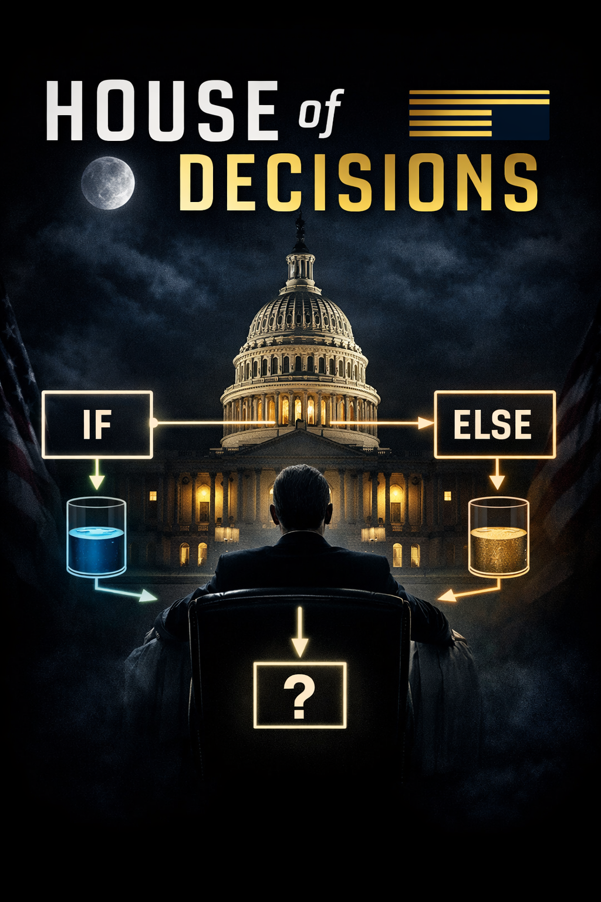

*Percebam que não existe certo ou errado aqui. Existem caminhos. O algoritmos não julgam: eles executam regras.*

<br>

A essa altura do campeonato, eu já não sei mais se te trato como aluno de pós-graduação ou como sobrevivente da *Recipe 8*. E não, não vou me desculpar por isso! Pelo oposto, vou te parabenizar! Você chegou até aqui!

Sendo bem franco: ainda estamos navegando no mesmo território iniciado no tutorial anterior (a temida *Recipe 8*). A diferença é que, agora, vamos criar um alicerce para expandir o uso de `function()` com novos conceitos. E aqui vai o ponto importante: **não faz sentido avançar nesta aula se a essência da anterior ainda não estiver clara para você.**

Agora, damos um passo além.

Vamos entrar no universo das funções condicionais. **É aqui que o código começa a tomar decisões.** Ao longo desta aula, vamos trabalhar com três elementos centrais: `if`, `else` e `ifelse()`.

<br>

# Funções Condicionais no R

Imaginem um exemplo dos mais simples: fazer compras em um supermercado.

Se formos preparados para comprar um determinado amaciante, já levamos algumas regras na cabeça: “Quero a Marca X. Se não tiver, aceito a Marca Y, mas não a Marca Z. Porém, se a Marca Y estiver cara demais, talvez eu considere a Marca Z”.

Perceba o que está acontecendo aqui: você está tomando decisões com base em condições.

É exatamente isso que as funções `if`, `else` e `ifelse(`) fazem no R! **Elas ensinam o computador a tomar decisões com base em regras explícitas.**

A palavra `if` significa **se.** Já `else` significa **caso contrário.**

Posto de outra forma, estamos sempre trabalhando com a lógica: “se algo for verdadeiro, faça isso; caso contrário, faça aquilo”.

Um pseudo-algoritmo para o exemplo anterior seria o seguinte:

<br>

**Ir ao supermercado:**
```{r eval = F}
if (Marca X disponível) {
  
  comprar Marca X
  
}

else {
    
  if (preço da Marca Y aceitável) {
      comprar Marca Y
      }
    else {
      comprar Marca Z
      }
}
```

Entenderam?

## As funções `if` e `else`

Agora vamos trazer isso para um exemplo simples.

Minha primeira construção de uma regra funcional foi, exatamente, com o exemplo a seguir. Sem dificuldades, eu poderia propor outro exemplo, mas manterei esse como singela menção de respeito e carinho aos professores Leonardo Barone e Jonathan Phillips:

Vamos registrar quantas xícaras de café você tomou até agora. Suponha que foram 3:
```{r}
qtde_cafe <- 3
```

Agora vamos criar uma regra direta para o R avaliar essa situação:
```{r}
if(qtde_cafe >= 3){
  print("Você está bem!")
}
```
Antes de entrar nos detalhes dos parênteses e das chaves, vamos dar um passo atrás e entender exatamente o que acabamos de escrever.

Começamos declarando a função `if`, isto é, queremos estabelecer uma regra, certo?

Logo após o `if`, explicitamos essa regra: **a quantidade de café deve ser maior ou igual a 3.** Essa condição está definida dentro dos parênteses. **Insisto: dentro dos parênteses de `if` deve haver, necessariamente, um teste lógico!**

Em seguida, indicamos ao R como ele deve agir caso essa condição seja satisfeita. Essa ação está definida dentro das chaves. No nosso caso, se a quantidade de café for maior ou igual a 3, pedimos que o R imprima a mensagem `"Você está bem!"`.

Resumindo e traduzindo diretamente o código: **R, se a quantidade de xícaras de café for maior ou igual a 3, diga ao usuário que está tudo bem.**

Agora, vamos analisar o código em si.

Após a função `if`, abrimos parênteses e, dentro deles, **devemos estabelecer uma condição cuja resposta seja, necessariamente, um valor lógico: `TRUE` ou `FALSE`.**

Se o resultado dessa condição for `TRUE`, o R executa o que está dentro das chaves. Caso contrário, ele simplesmente ignora esse bloco de código.

Voltando ao nosso exemplo, a condição `qtde_cafe >= 3` é avaliada como `TRUE`, pois o objeto `qtde_cafe` possui valor igual a `3`.

Como o resultado é `TRUE`, o R executa o conteúdo das chaves, ou seja, imprime a mensagem indicando que o usuário está bem abastecido de café no dia.

Vamos testar esse algoritmo?
```{r}
if(qtde_cafe >= 3){
  print("Você está bem!")
}
```

Funciona, certo? Parabéns! Você acabou de criar seu primeiro algoritmo com regras condicionais!

Agora vamos dar um passo além.

O que aconteceria se o valor do objeto `qtde_cafe` fosse alterado para `2`?

```{r}
qtde_cafe <- 2
```

Como o nosso algoritmo se comportaria nessa situação?

```{r}
if(qtde_cafe >= 3){
  print("Você está bem!")
}
```

**O R não fez nada. Por quê?**

Simples: O R não fez nada porque a condição dentro dos parênteses de `if` foi avaliada como `FALSE`.

E aqui está o ponto importante: quando a condição de um `if` é `FALSE`, o R simplesmente ignora o que está dentro das chaves e segue a vida. **No nosso exemplo, ele não “fez nada” porque você não disse o que deveria ser feito nesse caso.**

**Logo, o problema não é o R. O problema é que o algoritmo está incompleto.**

Para lidar com isso, usamos o `else`.

**A lógica agora passa a ser: se a condição for verdadeira, faça isso; caso contrário, faça aquilo.**

Aplicando ao nosso exemplo:

```{r echo=T, error=T, eval=FALSE}
if(qtde_cafe >= 3){
  print("Você está bem!")
} else {
  print("Tome mais café!")
}
```

E o R voltou a falar com a gente!

**Agora temos um algoritmo completo.**

Estamos dizendo ao R: Se a quantidade de café for maior ou igual a 3, informe que está tudo bem. Caso contrário, peça para o usuário tomar mais café.

Perceba a diferença de nível aqui: antes, o algoritmo só sabia agir em um cenário. Agora, ele sabe agir em dois.

---

Quero aproveitar este momento para expandir o uso das funções `if` e `else` e, principalmente, **mostrar como o R pensa ao executar regras condicionais.**

Vamos a um exemplo simples, mas extremamente didático.

Vamos salvar o número 7 em um objeto e criar regras para avaliar se esse valor é maior do que 4, 5, 6, 7 e 8.

```{r}
numero <- 7
```

Agora, considere o seguinte algoritmo:

```{r echo=T}
if(numero > 8){
  print("O objeto é maior do que 8")
}else if(numero > 7){
  print("O objeto é maior do que 7")
}else if(numero > 6){
  print("O objeto é maior do que 6")
}else if(numero > 5){
  print("O objeto é maior do que 5")
} else {
  print("O objeto é maior do que 4")
}
```

Perceberam o que fizemos aqui?

Estamos encadeando múltiplas condições usando `else if`. Isso nos permite construir regras progressivamente mais complexas.

**Agora, o ponto crítico:**

Cada condição é avaliada em sequência, de cima para baixo, e cada uma delas precisa retornar um valor lógico (`TRUE` ou `FALSE`).

**Se uma condição for `FALSE`, o R simplesmente passa para a próxima. Se for `TRUE`, ele executa o código associado e encerra o algoritmo imediatamente.** Assim, o R não continua verificando as outras condições.

Vamos aplicar isso ao nosso exemplo.

`numero > 8`: `FALSE`
`numero > 7`: `FALSE`
`numero > 6`: `TRUE`

**Nesse momento, o R imprime: `"O objeto é maior do que 6"`. E para por aí.**

Ele não chega a verificar as condições seguintes.

Agora vem um detalhe que muita gente ignora: **A última estrutura, o `else`, não tem condição.** Ele funciona como um “plano de contingência”, isto é, `else` é executado apenas se todas as condições anteriores falharem.

E aqui está a mensagem que você precisa levar para o resto da vida em programação: **A ordem das condições importa, e muito!** Se você mudar a ordem, você muda completamente o comportamento do algoritmo.

<br>

## A função `ifelse()`

Agora que entendemos as funções `if` e `else`, bem como seus aninhamentos, vamos falar sobre a função `ifelse()`.

**Aqui vai uma recomendação prática: use `ifelse()` de forma simples e objetiva. Idealmente, com uma única condição e duas respostas possíveis: uma para `TRUE` e outra para `FALSE`.**

Não que `ifelse()` não possa ser aninhada. Pode, sim. E dá para construir regras complexas com ela!

O problema é outro: legibilidade. Código com muitos `ifelse()` aninhados rapidamente se torna difícil de ler, entender e manter.

**Então, regra prática para as nossas aulas: Se precisar de múltiplas condições encadeadas, prefira `if + else if + else`.**

Agora, vamos entender a estrutura da função `ifelse()`.

A função `ifelse()` recebe três argumentos:

- `test`: uma condição lógica que deve retornar `TRUE` ou `FALSE`;
- `yes`: o que será retornado se o teste for `TRUE`;
- `no`: o que será retornado se o teste for `FALSE`.

Perceba o ponto importante: **o argumento `test` precisa obrigatoriamente resultar em um valor lógico.** Sem isso, a função simplesmente não funciona como esperado.

Vamos revisitar o exemplo das xícaras de café. Qual é o valor atual de `qtde_cafe`?
```{r}
qtde_cafe
```

Agora, uma implementação com `ifelse()`:
```{r}
ifelse(test = qtde_cafe >= 3,
       yes = "Você está bem!",
       no = "Tome mais café!")
```

Se `qtde_cafe` for igual a `2`, a condição `qtde_cafe >= 3` será avaliada como `FALSE`.

Nesse caso, o R retorna o valor definido no argumento no, ou seja: `"Tome mais café!"`. Simples assim.

Ah, e você pode combinar tudo o que viu nesse *script* com as funcionalidades do `tidyverse`!

---

Com isso, fechamos o núcleo das funções condicionais no R.

Você aprendeu a estruturar regras com `if`, lidar com alternativas com `else`, encadear decisões com `else if` e aplicar lógica de forma prática com `ifelse()`.

Mais do que decorar sintaxe, o ponto aqui é outro: você aprendeu a traduzir decisões humanas em lógica computacional. A partir daqui, o R deixa de ser apenas uma ferramenta que executa comandos e passa a ser um ambiente capaz de tomar decisões com base em regras que você definiu.

Se você domina isso, você não está mais só manipulando dados, você está começando a controlar o comportamento do algoritmo.

Nos próximoz *scripts*, vamos explorar como aplicar essas estruturas em contextos mais realistas, especialmente quando trabalhamos com bases de dados maiores.

E aí, sim, as coisas começam a ficar interessantes de verdade.

Porém, antes, ainda falta conversarmos sobre iteração e vetorização. Até lá!