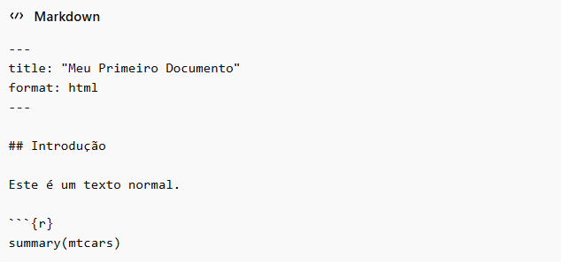

## Quarto

Até o momento, temos utilizado *scripts* (*File* \>\> *New File* \>\> *R Script*) para codar, aprender e solucionar problemas, o que, de fato, é bastante útil.

No entanto, há situações em que, além do código, precisamos integrar texto e os resultados gerados em um único documento reproduzível, organizado e de fácil compartilhamento.

Antes de ingressar em um curso de *stricto sensu*, é provável que você tenha utilizado editores de texto para comunicar resultados. O problema é que essas ferramentas produzem documentos sem reprodutibilidade.

Por outro lado, *scripts* em R, embora eficientes para análise, não oferecem uma estrutura adequada para a construção de uma narrativa. **O Quarto, ferramenta que estudaremos nesta aula, surge justamente para resolver esse problema.**

O Quarto é um sistema completo de publicação científica que permite integrar, em um único documento:

-   Código (R, Python, SQL, entre outros)
-   Texto (em Markdown)
-   Resultados (gráficos, tabelas, modelos, etc.)

Além disso, possibilita a exportação para múltiplos formatos, como `HTML`, `PDF`, Word, apresentações (*slides*) e até *websites* completos.

Em termos práticos, isso significa que você escreve uma única vez e pode publicar em diferentes formatos, mantendo consistência e reprodutibilidade!

## O Valor Gerado pelo Quarto

Se você ainda não captou como o Quarto pode facilitar sua vida, deixe-me propor a seguinte situação:

Você rodou uma análise em R, gerou gráficos e encontrou resultados interessantes.

Agora você precisa comunicar seus achados, então você cola os resultados no Word e explica textualmente o que fez, certo?

Porém, se houver alguma atualização na sua base de dados, você vai ter que refazer manualmente tudo, certo? Cada gráfico, cada tabela, cada saída de modelo. Isso, além de ineficiente, é perigoso!

É perigoso porque humanos erram com facilidade, sejam pelo cansaço, seja pelo tédio em repetir tarefas, seja por subestimarem situações em que se sentem confortáveis.

**O Quarto resolve, exatamente, todos os problemas narrados.**

Ele permite que código, texto e resultados convivam no mesmo documento, de forma automática e reproduzível. Dessa forma, se os dados mudarem, você não precisará reescrever o relatório. Você apenas o renderizará novamente.

## Criando um Arquivo de Extensão `*.qmd`

Para criar um documento Quarto, basta ir em *File* \>\> *New File* \>\> *Quarto Document*.

Uma janela pop-up surgirá e você já poderá informar, se quiser, o título e autores de seu relatório, bem como a extensão de saída: html, pdf ou docx. Recomendo sempre deixar e html, e sim, você poderá alterar as saídas desejadas sempre que necessitar.

## Estrutura de um arquivo `.qmd`

Antes de nos aprofundarmos, vamos tentar entender a estrutura de um arquivo `.qmd`: 



A imagem anterior divide a estrutura de um arquivo `.qmd` em três blocos:

1.  **YAML (cabeçalho)**: configura o documento
2.  **Texto (Markdown)**: narrativa
3.  **Chunks de código**: execução

### YAML

O YAML (a pronúncia é algo como “yámel”) é um formato de configuração utilizado para definir como o documento deve se comportar.

O YAML não realiza cálculos nem executa código. Sua função é apenas indicar ao Quarto como o documento deve ser estruturado e apresentado.

Por meio do YAML, podemos definir elementos como o título do documento, o formato de saída (HTML, PDF, Word), o autor e diversas opções de exibição.

O YAML segue uma lógica simples baseada em pares de chave e valor:

```{r eval = F}
chave: valor
```

Exemplo:

```{r eval = F}
title: "Relatório Final"
format: html
```

As principais chaves introdutórias são:

```{r eval=F}
title: define o título do documento (deve ser escrito entre aspas);
format: define o formato de saída (html, pdf ou docx);
editor: visual permite editar o documento no modo visual;
toc: true cria um sumário automático; false remove o sumário.
```

Depois de configurar seu arquivo Quarto, você poderá seguir para a narrativa de seu relatório.

### Markdown

Markdown é uma linguagem de marcação leve utilizada para escrever texto formatado de forma simples e rápida, utilizando apenas caracteres do teclado.

Em vez de recorrer a menus, como em editores de texto tradicionais (por exemplo, o Word), utilizamos símbolos para estruturar o conteúdo:

`#` representa um título `##` representa um subtítulo `*texto*` representa texto em itálico `**texto**` representa texto em negrito `-` representa itens em lista

No Quarto, o texto escrito em Markdown é interpretado e convertido automaticamente em um documento formatado.

E não, Markdown não é uma linguagem de programação. Ele é apenas uma forma de estruturar texto.

Uma forma simples de pensar: o Markdown organiza o texto; o R executa o código; e o Quarto integra tudo em um único documento.

Também podemos recorrer a alguns comandos do LaTeX para, principalmente, escrever fórmulas matemáticas.

No Quarto, o LaTeX é utilizado dentro do Markdown para representar expressões matemáticas de forma mais precisa.

Por exemplo:

$$
y = \beta_0 + \beta_1 x
$$

Para mais detalhes sobre a sintaxe matemática do LaTeX, recomenda-se a leitura do Capítulo 3 do seguinte [manual](https://each.uspnet.usp.br/sarajane/wp-content/uploads/2016/10/manual-latex-1.pdf).

Ao fazer a leitura sugerida, tenha em mente o seguinte:
```{r eval = F}
Para escrever fórmulas matemáticas no Quarto, utilizamos:

$ ... $ para expressões inline (no meio do texto)

$$ ... $$ para expressões destacadas (em bloco)
```

Em grande parte dos casos, sua narrativa será ancorada por códigos de alguma linguagem computacional, seja por meio de gráficos, tabelas, modelos ou estatísticas descritivas.

No Quarto, esses códigos são inseridos em blocos chamados *chunks de código* (*Ctrl + Alt + I* em máquinas Windows e Linux; ou *Command + Alt + I* em máquinas Apple).

Um *chunk de código* é um espaço delimitado dentro do documento no qual o código é escrito e executado, e cujo resultado é automaticamente incorporado ao documento final.

Em termos práticos, você escreve seus códigos dentro dos *chunks* e, ao renderizar o documento, o Quarto executa esse código e insere o resultado diretamente no arquivo final.


## Renderizando

Até aqui, escrevemos texto em Markdown e inserimos códigos em *chunks*. No entanto, nada disso faz sentido até que o documento seja renderizado.

Renderizar significa transformar o arquivo `.qmd` em um documento final, como HTML, PDF ou Word, com todo o código executado e os resultados incorporados.

Para isso, basta clicar no botão **Render** no RStudio.

Ao clicar em *Render*, o Quarto realizará automaticamente os seguintes passos:

1. Lerá o YAML para identificar as configurações do documento;  
2. Executará todos os *chunks de código*, **em ordem cronológica**;  
3. Converterá o Markdown em texto formatado;  
4. Gerará o arquivo final (por exemplo, `.html`). 


O valor do Quarto está no seguinte: Se os dados mudarem, você não precisa reescrever o relatório; basta renderizar novamente!

Por assim ser, a partir deste momento, você vai deixar de produzir códigos soltos ou relatórios manuais. Você passará a produzir documentos analíticos completos, em que cada resultado pode ser reproduzido, atualizado e validado automaticamente.

## Formatação básica de texto

Diferentemente de editores como o Microsoft Word, a formatação de texto em Markdown não depende de cliques em botões. Em vez disso, utilizamos caracteres diretamente no documento para indicar a formatação desejada.

---

### Ênfase de texto

*Itálico* -`*Itálico*`  
**Negrito** - `**Negrito**`  

---

### Títulos

# Título principal  
`# Título principal`

## Subtítulo  
`## Subtítulo`

### Sub-subtítulo  
`### Sub-subtítulo`

---

### Links

[Google](https://www.google.com): `[Google](https://www.google.com)`

---

### Listas

**Lista com marcadores:**

- Item  
  - Subitem  

`- Item`  
`[espaços]  - Subitem`

---

**Lista numerada:**

1. Item  
   1. Subitem  

`1. Item`  
`[espaços]   1. Subitem`

---

Para mais detalhes, consulte o cheatsheet oficial:

https://rstudio.github.io/cheatsheets/html/rmarkdown.html

## Equações
Podemos escrever equações com a linguagem de Latex. Dentro de uma frase, use `$ equation $`, e para centralizar numa nova linha use `$$ big equation $$`. A sintaxe é assim:

`$$\alpha^2 + \beta^2 = \chi^2$$` $$\alpha^2 + \beta^2 = \chi^2$$  
`$$\frac{\sqrt{1}}{2} * \frac{a}{2b} = \frac{a}{4b}$$` $$\frac{\sqrt{1}}{2} * \frac{a}{2b} = \frac{a}{4b}$$
`$$\sum_0^{10} x = ...$$` $$\sum_0^{10} x = ...$$

## Código *in-line*: incluindo resultados no texto

Em muitos casos, realizamos uma análise em um *chunk* de código e armazenamos o resultado em um objeto no R.

Por exemplo, podemos calcular a área de um círculo de raio 20:
```{r}
raio <- 20
area <- pi * raio^2
```

Uma das funcionalidades mais úteis do Quarto é a possibilidade de inserir resultados diretamente no texto, de forma automática.

Para isso, utilizamos o chamado **código in-line**.

A sintaxe é:
```{r eval = F}
`r objeto`
```

Exemplo:

A área de um círculo de raio 20 é `r area`.