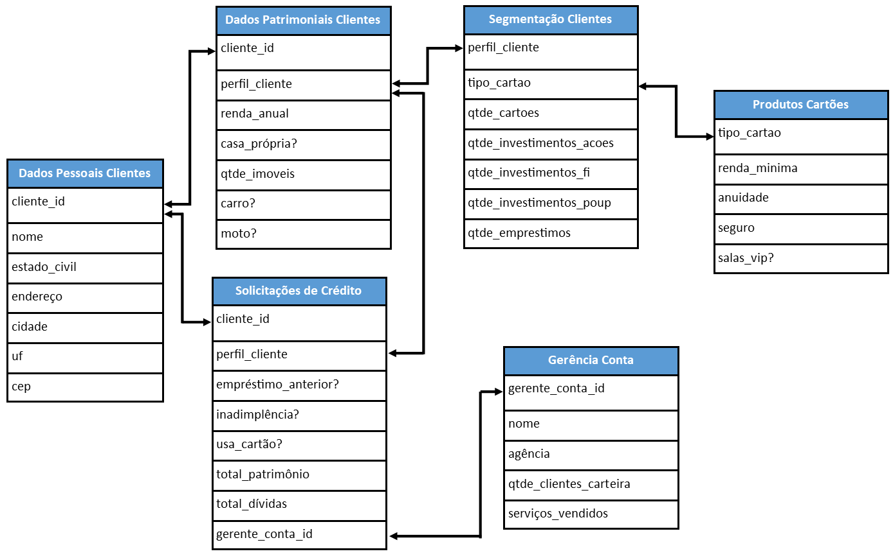

Bem-vindos(as)!

Hoje a aula é sobre combinarmos o R com a linguagem SQL! Assim, poderemos trabalhar com bases de dados muuuuuuito grandes, combinando o poder de *analytics* do R!

A sigla SQL vem de *Structured Query Language* e corresponde a uma linguagem utilizada para consultar, manipular e organizar dados armazenados em bancos de dados relacionais.

Imagine uma instituição bancária. Esse tipo de organização lida diariamente com milhões de clientes, milhares de funcionários e um volume massivo de transações financeiras.

Cada cliente possui características próprias, cada transação gera novos registros e cada setor da empresa produz informações específicas. Ao longo do tempo, essa quantidade de dados cresce de forma extremamente rápida.

Diante disso, surge um problema: como organizar tudo isso de forma eficiente?

Uma solução ingênua seria armazenar tudo em uma única tabela. Porém, isso dificultaria a organização dos dados, aumentaria redundâncias e tornaria a manutenção muito mais complexa.

A alternativa mais eficiente é estruturar essas informações em múltiplas tabelas temáticas, como clientes, funcionários e transações, por exemplo.

Essas tabelas não ficam isoladas. Elas se conectam entre si por meio de chaves:

- ***Primary Key*** (chave primária): identifica unicamente cada registro em uma tabela
- ***Foreign Key*** (chave estrangeira): permite conectar registros entre tabelas diferentes

Esse modelo é conhecido como banco de dados relacional. Note:


A imagem acima representa a estrutura de um banco de dados relacional, composto por seis tabelas distintas, cada uma responsável por armazenar um tipo específico de informação.

Cada tabela possui colunas (variáveis) que descrevem as características dos dados armazenados. Por exemplo, a tabela **Dados Pessoais Clientes** contém informações como nome, estado civil e localização, enquanto a tabela **Produtos Cartões** descreve características dos cartões oferecidos pelo banco.

O ponto mais importante não está nas tabelas isoladamente, mas sim na forma como elas se conectam entre si.

As setas indicam essas conexões e representam relações entre tabelas, que ocorrem por meio de chaves:

- A *Primary Key* identifica unicamente cada registro dentro de uma tabela
- A *Foreign Key* permite que uma tabela “aponte” para outra

Por exemplo:

- O campo `cliente_id` aparece em múltiplas tabelas, permitindo relacionar informações pessoais, patrimoniais e de crédito de um mesmo cliente;

- O campo `perfil_cliente` conecta informações de segmentação com dados patrimoniais e de crédito;

- O campo `tipo_cartao` conecta clientes aos produtos oferecidos.

Na prática, isso significa que os dados estão distribuídos, mas podem ser recombinados conforme a necessidade.

É exatamente isso que faremos com SQL: reunir informações que estão separadas em diferentes tabelas para responder perguntas específicas.

Neste curso, nosso foco estará principalmente em consultas e manipulação de dados, que são as habilidades mais utilizadas no dia a dia.

Para começar, utilizaremos um banco de dados fictício de um e-commerce, composto por três tabelas:

- **CLIENTES**;
- **PRODUTOS**;
- **VENDAS**.

# Fazendo Consultas com a Linguagem SQL no Linguagem R

A partir deste momento, aprenderemos a integrar o R com bancos de dados relacionais por meio da linguagem SQL.

Com isso, poderemos realizar consultas (queries) diretamente em bases de dados potencialmente grandes, trazendo para o R apenas os dados já filtrados e organizados. Isso é especialmente útil quando desejamos realizar análises, visualizações ou aplicar modelos estatísticos de forma eficiente.

Para isso, utilizaremos dois pacotes fundamentais. O paceote `DBI` fornece uma interface padronizada para conexão com diferentes bancos de dados. Já o pacote `RMariaDB` atua como o *driver* que permite ao R se conectar a bancos compatíveis com MySQL/MariaDB.

```{r}
#| message: false
#| warning: false
#| paged-print: false
library(tidyverse)
library(DBI)
library(RMariaDB)
```

## Estabelecendo a Conexão

Feito isso, nós iremos gerar uma conexão com o Banco de Dados Relacional a ser utilizado. 

No exemplo a seguir, utilizaremos um banco de dados hospedado online. Para isso, precisamos informar ao R alguns parâmetros essenciais:

- `host`: endereço do servidor onde o banco está hospedado;
- `port`: porta de comunicação;
- `dbname`: nome do banco de dados;
- `user` e `password`: credenciais de acesso.

```{r}
conexao <- dbConnect(
  MariaDB(),
  dbname = "sql10823026",
  host = "sql10.freesqldatabase.com",
  port = 3306,
  user = "sql10823026",
  password = "bmbQ36Sh8A"
)
```

A função `dbConnect()`, do pacote `DBI`, estabelece essa conexão. Ao executá-la com sucesso, o R passa a ter acesso ao banco de dados especificado.

## Explorando o Banco de Dados

Uma vez conectados, podemos verificar quais tabelas existem no banco de dados utilizando a função `dbListTables()`:

```{r}
dbListTables(conn = conexao)
```

Essa função retorna os nomes das tabelas disponíveis. No nosso caso, temos:

-   ***CLIENTES***;

-   ***PRODUTOS***;

-   ***VENDAS***.

## Explorando a Estrutura de uma Tabela

Por outro lado, para entender melhor o conteúdo de uma tabela, é importante conhecer suas colunas. Para isso, utilizamos a função `dbListFields()`:
```{r}
dbListFields(conexao, "CLIENTES")
```

Com isso, conseguimos visualizar quais variáveis estão disponíveis na tabela **CLIENTES**, o que será fundamental para a construção de nossas consultas!

Porém, é importante destacar que, caso desejemos acessar uma tabela de um banco de dados SQL a partir do R, podemos utilizar a função `tbl()`, do pacote `dplyr` (parte integrante do `tidyverse`):
```{r}
df_clientes <- tbl(conexao, "CLIENTES")

df_clientes
```

Nesse momento, algo importante acontece: **os dados ainda não foram carregados para o R.**

O objeto `df_clientes` funciona como uma referência à tabela existente no banco de dados. Noutras palavras, estamos apenas apontando para essa tabela, e não trazendo seus dados efetivamente para o ambiente do R.

Para, de fato, importar os dados para o R na forma de um data frame, é necessário utilizar a função `collect()`:
```{r}
df_clientes <- df_clientes  |> 
  collect()
```

Se você já estiver se sentindo mais seguro(a), pode refazer esses passos de forma mais direta:
```{r}
df_clientes <- tbl(conexao, "CLIENTES") |> 
  collect()
```

### Executando *Queries* em SQL: O Comando `SELECT`

O primeiro comando que aprenderemos na linguagem SQL será uma declaração de seleção.

Lembrem-se de que, quando estivermos lidando com SQL, é comum nos referirmos aos códigos como declarações, comandos ou, de forma mais geral, como consultas (*queries*).

Para iniciarmos a construção dessas declarações, o primeiro comando (ou, se preferirem, o primeiro “verbo”) a ser estudado será o `SELECT`.

A palavra inglesa *select* significa “selecionar”. Portanto, será com o comando `SELECT` que realizaremos nossas consultas em tabelas de um banco de dados. Em outras palavras, sempre que quisermos extrair informações de uma tabela, estaremos, de alguma forma, utilizando o `SELECT`.

Por essa razão, o comando `SELECT` é um dos elementos mais importantes, e absolutamente obrigatórios,  da linguagem SQL. 

Lembrem-se também de um ponto conceitual importante: o resultado da execução de um comando `SELECT` será sempre uma nova tabela (ou, mais precisamente, um conjunto de resultados tabular), que ficará armazenado de forma temporária.

Assim, ao executar um `SELECT`, não estamos alterando o banco de dados original. **Estamos apenas consultando os dados e visualizando o resultado dessa consulta.**

Dito de outra forma: o comando `SELECT` não salva automaticamente o resultado da consulta. Caso desejemos persistir esse resultado, isso deverá ser feito explicitamente por meio de outros comandos ou ferramentas, que veremos em momento oportuno mais à frente.

Agora, retomando uma ideia importante que já discutimos anteriormente: quando estamos diante de um comando (ou de um “verbo”, se preferirem manter essa analogia), precisamos ser extremamente literais.

Não adianta escrever apenas:
```{r eval = F}
SELECT
```

Se fizermos isso, o banco de dados simplesmente não saberá o que deve ser selecionado. Em termos práticos, isso resultará em um erro de sintaxe, pois a instrução está incompleta.

É como se estivéssemos dizendo apenas “selecione”, sem dizer o que deve ser selecionado.

Por isso, o comando `SELECT` precisa, necessariamente, de complementos. O primeiro deles é o comando `FROM`, que indica de qual tabela queremos extrair os dados. Além disso, precisamos indicar quais colunas queremos selecionar.

A estrutura mais básica possível de uma consulta SQL é, portanto, a seguinte:
```{r eval = F}
# Exemplo lúdico

SELECT colunas
FROM tabela
```

Em muitos casos, especialmente quando estamos explorando uma tabela pela primeira vez, pode ser interessante selecionar todas as colunas disponíveis.

Para isso, utilizamos o símbolo `*`, que significa “todas as colunas”.

Assim, a instrução:
```{r eval = F}
# Exemplo lúdico

SELECT *
FROM CLIENTES
```

pode ser lida como: “selecione todas as colunas da tabela CLIENTES”.

**Agora, vamos executar essa consulta dentro do R!**

Para isso, utilizaremos a função `dbGetQuery()`, do pacote `DBI`, que permite enviar comandos SQL diretamente ao banco de dados e retornar o resultado já no R:
```{r}
dbGetQuery(
  conexao,
  "SELECT
     *
   FROM CLIENTES
   LIMIT 10"
)
```

Observe que, além do `SELECT` e do `FROM`, utilizamos também o comando `LIMIT 10`.

**Esse comando serve para restringir a quantidade de linhas retornadas pela consulta.** No caso, estamos pedindo ao banco que nos mostre apenas os 10 primeiros registros da tabela.

Essa é uma prática bastante comum, **e recomendada,** quando estamos explorando tabelas, especialmente aquelas que podem conter um grande volume de dados. É algo como a função `head()` do R, lembram?

---

Vamos praticar:

**EXERCÍCIO 01**

Tente selecionar as variáveis `SKU`, `TIPO` e `MARCA`, da tabela ***PRODUTOS***. Depois, crie uma nova *query* que selecione as colunas `SKU`, `CUSTO_COMPRA` e ``, da tabela ***PRODUTOS***.

---

### Executando Operações Matemáticas Simples com o Verbo `SELECT`

Também podemos utilizar o comando `SELECT` para realizar operações matemáticas diretamente sobre os dados!

Por exemplo, a coluna `CUSTO_COMPRA` da tabela **PRODUTOS** está mensurada em reais. Podemos converter seus valores para dólares norte-americanos dividindo-os por 4,99.

Para realizar uma divisão em SQL, utilizamos o operador `/`.

Vamos, então, propor uma consulta em que selecionaremos:

- a variável `SKU`;
- a variável `CUSTO_COMPRA`, mas convertida para dólares.

```{r}
dbGetQuery(
  conexao,
  "SELECT
     SKU,
     CUSTO_COMPRA / 4.99
   FROM PRODUTOS
   LIMIT 10"
)
```

Em termos de cálculo, atingimos nosso objetivo, certo?

**Porém, observe um detalhe importante: o nome da coluna resultante da divisão não ficou muito amigável.**

Em vez de algo como `CUSTO_COMPRA_USD`, o banco retorna um nome genérico, normalmente baseado na própria expressão utilizada (algo como `CUSTO_COMPRA / 4.99`).

Isso não é, necessariamente, um erro, mas pode dificultar a interpretação dos resultados, e é exatamente isso que vamos corrigir na sequência.

Antes disso, vamos apresentar os principais operadores matemáticos utilizados em SQL:

| Operador | Função                                                                   |
|-------------------|-----------------------------------------------------|
| `+`      | Soma.                                                                    |
| `-`      | Subtração.                                                               |
| `*`      | Multiplicação.                                                           |
| `/`      | Divisão.                                                                 |
| `%`      | Módulo (retorna o resto de uma divisão). Exemplo: 15 % 4 resultará em 3. |


---

**EXERCÍCIO 02**

A partir da tabela ***PRODUTOS***, tente selecionar as variáveis `SKU`, `CUSTO_COMPRA` (mensurada em Reais) e `VALOR_VENDA` (mensurada em Euros - assuma €1 = R\$ 5,88).

---

### Renomeando Variáveis: `AS`

O `AS` é o responsável pela geração de *alias* (apelidos) no SQL.

*Apelidos?*

**Sim, apelidos!**

Lembrem-se de que comentamos que o comando `SELECT` gera uma consulta, em forma de uma nova tabela, mas que não necessariamente ficará salva na sua máquina e/ou nuvem!

Vamos observar isso na prática.

Suponha que desejemos selecionar as colunas `COD_CLIENTE`, `PRIMEIRO_NOME` e `SOBRENOME`, da tabela **CLIENTES**, e renomeá-las da seguinte maneira:

1. `COD_CLIENTE` para `ID`;
2. `PRIMEIRO_NOME` para `FIRST_NAME`;
3. `SOBRENOME` para `SURNAME`:

```{r}
dbGetQuery(
  conexao,
  "SELECT
     COD_CLIENTE AS ID,
     PRIMEIRO_NOME AS FIRST_NAME,
     SOBRENOME AS SURNAME
   FROM CLIENTES
   LIMIT 10"
)
```

O ponto importante é o seguinte: **as variáveis foram renomeadas apenas para o resultado dessa consulta,** ou seja, o banco de dados original não foi alterado.

Vamos confirmar isso consultando novamente a tabela original:
```{r}
dbGetQuery(
  conexao,
  "SELECT
     *
   FROM CLIENTES
   LIMIT 10"
)
```

Notaram?

Os nomes `ID`, `FIRST_NAME` e `SURNAME` foram apenas apelidos temporários para as variáveis `COD_CLIENTE`, `PRIMEIRO_NOME` e `SOBRENOME`. Isso, portanto, é só um efeito da consulta.

O `AS` não serve apenas para renomear colunas existentes, ele também pode ser utilizado para dar nomes a colunas criadas a partir de expressões.

Por exemplo, no caso em que calculamos:
```{r eval = F}
CUSTO_COMPRA / 4.99
```

podemos escrever:
```{r eval = F}
CUSTO_COMPRA / 4.99 AS CUSTO_COMPRA_USD
```

e isso torna o resultado muito mais legível.

---

**EXERCÍCIO 03**

Lembram-se quando aprendemos a fazer contas simples no SQL e queríamos o custo das compras em US$?

Lembram-se que o nome da coluna ficou algo como `CUSTO_COMPRA / 4.99`?

Pois é!

Selecione as variáveis `SKU`, `CUSTO_COMPRA` e `VALOR_VENDA`, e apresente seus valores em dólares, garantindo que os nomes das colunas permaneçam organizados e compreensíveis.

**EXERCÍCIO 04**

A partir da *query* do **Exercício 03**, crie uma nova variável chamada `LUCRO_BRUTO`, definida como a diferença entre o valor de venda e o custo da compra.

---

### Arredondando Valores: A Função `ROUND() `

As colunas `CUSTO_COMPRA`, `VALOR_VENDA` e `LUCRO_BRUTO` que criamos nos **Exercícios 03 e 04** não ficaram tão legais, certo?

As operações matemáticas propostas geraram valores com muitas casas decimais, o que dificulta a leitura e interpretação dos resultados.

A maneira como declaramos a função responsável pelo arredondamento numérico no SQL é um pouco diferente do que vimos até o momento.

A função `ROUND()`, assim como no R, exige dois argumentos:

- o primeiro deve ser o número (ou expressão numérica) que desejamos arredondar;
- o segundo deve ser a quantidade de casas decimais.

Observe a seguinte declaração:
```{r eval = F}
ROUND(CUSTO_COMPRA / 4.99, 2)
```

No exemplo acima, estamos dizendo ao banco de dados: “pegue o resultado da divisão `CUSTO_COMPRA / 4.99` e arredonde para 2 casas decimais”.

Assim como vimos anteriormente, podemos utilizar essa expressão dentro de um `SELECT`.

Por exemplo:
```{r}
dbGetQuery(
  conexao,
  "SELECT
     SKU,
     ROUND(CUSTO_COMPRA / 4.99, 2) AS CUSTO_COMPRA_USD
   FROM PRODUTOS
   LIMIT 10"
)
```

### Contando Valores com o SQL

O comando `COUNT(*)` possibilita a contagem de registros em dada tabela:
```{r}
dbGetQuery(
  conexao,
  "SELECT
     COUNT(*) AS QTDE_LINHAS
   FROM CLIENTES
   LIMIT 10"
)
```


### Selecionando Valores Únicos com o Verbo `SELECT DISTINCT`

O comando `SELECT DISTINCT` é utilizado para evidenciar valores únicos em uma tabela, ou seja, valores não duplicados.

Podemos utilizar o `SELECT DISTINCT`, por exemplo, para identificar quais são as filiais existentes em nossa empresa de e-commerce.

Note que a coluna `LOJA`, da tabela **VENDAS**, contém os nomes das filiais, porém com repetições, afinal, uma mesma filial pode aparecer em diversas vendas.

Para visualizar apenas os valores únicos dessa variável, podemos executar:
```{r}
dbGetQuery(
  conexao,
  "SELECT DISTINCT
     LOJA
   FROM VENDAS"
)
```
**Observe que, nesse caso, estamos listando as filiais existentes, e não contando quantas são.**

Caso desejássemos obter a quantidade de filiais, precisaríamos de uma abordagem adicional (veremos isso mais adiante).

---

**EXERCÍCIO 05**

A abordagem a seguir **NÃO** funciona para verificarmos os valores únicos da variável `LOJA`. Por quê?
```{r eval = F}
dbGetQuery(
  conexao,
  "SELECT DISTINCT
     *
   FROM VENDAS"
)
```

Dica: pense no que significa aplicar o `DISTINCT` quando estamos selecionando todas as colunas ao mesmo tempo.


**EXERCÍCIO 06**

Proponha uma abordagem que evidencie quais são as modalidades de pagamento aceitas pela nossa empresa.

Dica: identifique a variável que representa a forma de pagamento e utilize o comando adequado para eliminar duplicações.

---

### Concatenação de Textos

No SQL, também podemos concatenar textos, isto é, juntar valores textuais para gerar novas observações em novas variáveis.

Por exemplo, na Tabela **CLIENTES**, temos os primeiros nomes e sobrenomes de todos os nossos clientes, certo?

E se quiséssemos criar uma variável que contivesse os nomes completos desses indivíduos?

Em bancos de dados como MySQL/MariaDB, utilizamos a função `CONCAT()` para realizar essa operação:
```{r}
dbGetQuery(
  conexao,
  "SELECT
     COD_CLIENTE,
     PRIMEIRO_NOME,
     SOBRENOME,
     CONCAT(PRIMEIRO_NOME, SOBRENOME) AS NOME_COMPLETO
   FROM CLIENTES
   LIMIT 10"
)
```

Perceberam que os valores foram concatenados/colapsados?

Porém, ainda temos um problema: não há espaço entre o nome e o sobrenome. Podemos resolver isso inserindo explicitamente um espaço:
```{r}
dbGetQuery(
  conexao,
  "SELECT
     COD_CLIENTE,
     PRIMEIRO_NOME,
     SOBRENOME,
     CONCAT(PRIMEIRO_NOME, ' ', SOBRENOME) AS NOME_COMPLETO
   FROM CLIENTES
   LIMIT 10"
)
```

Agora sim, temos uma nova variável `NOME_COMPLETO` com a formatação adequada!

### Principais Operadores na Linguagem SQL

Nós já apresentamos os principais operadores algébricos, lembram-se?

***Principais Operadores Algébricos***
| Operador | Função                                                  |
| :------: | ------------------------------------------------------- |
|    `+`   | Soma                                                    |
|    `-`   | Subtração                                               |
|    `*`   | Multiplicação                                           |
|    `/`   | Divisão                                                 |
|    `%`   | Módulo (resto da divisão). Exemplo: 15 % 4 resulta em 3 |


Esses operadores são utilizados para realizar cálculos numéricos.

<br>

***Principais Operadores de Comparação***

Além dos operadores algébricos, temos os operadores de comparação, que permitem comparar valores:
|  Operador | Função                                |
| :-------: | ------------------------------------- |
|    `=`    | Igual a                               |
|    `<>`   | Diferente de                          |
|    `!=`   | Diferente de                          |
|    `>`    | Maior que                             |
|    `<`    | Menor que                             |
|    `>=`   | Maior ou igual                        |
|    `<=`   | Menor ou igual                        |
| `BETWEEN` | Entre dois valores                    |
|   `LIKE`  | Busca por padrão de texto             |
|    `IN`   | Verifica se o valor está em uma lista |


<br>

***Principais Operadores Lógicos***

Também podemos combinar condições utilizando operadores lógicos:
|  Operador | Significado   |
| :-------: | ------------- |
|   `NOT`   | Não           |
|   `AND`   | E             |
|    `OR`   | Ou            |
| `IS NULL` | Valor ausente |


<br>

Dito isso, suponha que queiramos identificar os clientes maiores de idade, considerando a maioridade a partir dos 18 anos.

```{r}
dbGetQuery(
  conexao,
  "SELECT
     COD_CLIENTE,
     IDADE,
     IDADE >= 18 AS MAIORIDADE
  FROM CLIENTES
   LIMIT 10"
)
```

Observe que criamos uma nova variável chamada `MAIORIDADE`, que assume valores 0 ou 1.

Podemos também verificar se a idade está dentro de um determinado intervalo:
```{r}
dbGetQuery(
  conexao,
  "SELECT
     COD_CLIENTE,
     IDADE,
     IDADE BETWEEN 18 AND 60 AS FAIXA_IDADE
   FROM CLIENTES
   LIMIT 10"
)
```

Aqui estamos verificando se a idade está entre 18 e 60 anos.

---

**EXERCÍCIO 07**

Utilizando a Tabela **VENDAS**, selecione as linhas em que o valor da coluna `QUANTIDADE` seja maior que 4.

**EXERCÍCIO 08**
Utilizando a Tabela **CLIENTES**, crie uma variável que classifique o tamanho da família com base no número de filhos:

| Quantidade de Filhos  | Tamanho da Família |
| --------------------- | ------------------ |
| 0 a 1 filho(a)        | Família Pequena    |
| 2 a 3 filhos(as)      | Família Média      |
| Acima de 3 filhos(as) | Família Grande     |

### Utilizando Filtros: `WHERE`

Percebam que, até o momento, não houve uma filtragem das observações com 18 anos de idade ou mais. O que fizemos anteriormente foi identificar esses indivíduos, por meio da criação de uma variável *dummy*.

Caso quiséssemos, de fato, filtrar as observações maiores de idade, deveríamos utilizar o comando `WHERE`:
```{r}
dbGetQuery(
  conexao,
  "SELECT
     *
   FROM CLIENTES
   WHERE IDADE >= 18"
)
```

Podemos também combinar múltiplas condições. Por exemplo, suponha que quiséssemos selecionar clientes maiores de idade e com idade inferior a 60 anos:
```{r}
dbGetQuery(
  conexao,
  "SELECT
     *
   FROM CLIENTES
   WHERE IDADE >= 18 AND IDADE < 60"
)
```

Notaram a diferença entre as abordagens?

---

**EXERCÍCIO 09**

Proponha uma rotina que **FILTRE** todas as observações da tabela **VENDAS** referentes a:

1) produtos vendidos no ano de 2022;
2) com utilização de cartão de crédito.

---

Também podemos filtrar observações com valores textuais! Por exemplo, como poderíamos fazer para filtrar as observações cujo sobrenome fosse `MCGUIRE`?

Será que a rotina a seguir funcionará?
```{r}
dbGetQuery(conexao, 
           "SELECT
              *
           FROM CLIENTES
           WHERE SOBRENOME = 'MCGUIRE'")
```

Sim, funciona!

Uma hipótese comum seria pensar que, ao trabalharmos com valores textuais, a linguagem SQL diferencia letras maiúsculas e minúsculas (*case sensitive*). No entanto, em bancos como MySQL/MariaDB, isso geralmente não ocorre, pois as comparações textuais costumam ser *case insensitive*. Assim, `MCGUIRE` e `Mcguire` tendem a ser tratados como equivalentes.

E se quiséssemos filtrar os personagens da base de dados cujo primeiro nome fosse iniciado pela letra L?
```{r}
dbGetQuery(conexao, 
           "SELECT
              *
           FROM CLIENTES
           WHERE PRIMEIRO_NOME LIKE 'L%'")
```

Entenderam a declaração? O símbolo `%` representa qualquer sequência de caracteres, ou seja, `L%` indica os nomes que começam com a letra L.

Vamos treinar mais uma vez! Suponhamos que desejemos estabelecer um filtro em que possamos visualizar os indivíduos cujo primeiro nome se **encerre** com a letra A:
```{r}
dbGetQuery(conexao, 
           "SELECT
              *
           FROM CLIENTES
           WHERE PRIMEIRO_NOME LIKE '%A'")
```

Notaram a mudança de posição do operador `%`?

---

**EXERCÍCIO 10**

Estabeleça uma rotina em que haja o filtro de clientes que possuam a letra S em seu primeiro nome, independentemente de sua posição, isto é, a letra S também deve ser considerada no meio dos primeiros nomes.

---

E caso quiséssemos filtrar as vendas ocorridas nas filiais de **Ribeirão Preto** e de **Campinas**, apenas?

Provavelmente, você pensou na seguinte rotina:
```{r}
dbGetQuery(conexao, 
           "SELECT
	            *
	         FROM VENDAS
           WHERE LOJA = 'Ribeirão Preto' OR LOJA = 'Campinas'")
```

Os comandos anteriores estão corretos, mas há uma maneira mais direta de se fazer a tarefa proposta:
```{r}
dbGetQuery(conexao, 
           "SELECT
	            *
	         FROM VENDAS
           WHERE LOJA IN ('Ribeirão Preto', 'Campinas')")
```

Com os comandos de filtros, também podemos identificar os *missing values* em nossas bases de dados.

Por exemplo: como apresentar os indivíduos que não possuem o preenchimento do campo sobrenome?
```{r}
dbGetQuery(conexao, 
           "SELECT
              *
           FROM CLIENTES
           WHERE SOBRENOME IS NULL")
```

<br>

---

**EXERCÍCIO 11**

Apresente apenas os indivíduos que possuam o preenchimento do campo sobrenome, isto é, as observações sem a presença de *missing values* para a variável mencionada.

---

### Organizando os Dados: `ORDER BY`

Também pode ser interessante organizar as observações filtradas seguindo algum critério (e.g.: ordem crescente; ordem alfabética; etc.). Podemos fazer isso com o auxílio do comando `ORDER BY`.

Suponha que quiséssemos organizar os primeiros nomes dos clientes da base de dados em ordem alfabética:
```{r}
dbGetQuery(conexao, 
           "SELECT
              *
           FROM CLIENTES
           ORDER BY PRIMEIRO_NOME ASC")
```

Notaram o operador `ASC`?

Ele é uma abreviação da palavra ascending, que significa ascendente, ou seja, ordem crescente (alfabética, já que estamos trabalhando com textos).

Para inverter essa lógica, basta declarar `DESC`, isto é, *descending*:
```{r}
dbGetQuery(conexao, 
           "SELECT
              *
           FROM CLIENTES
           ORDER BY PRIMEIRO_NOME DESC")
```

---

**EXERCÍCIO 12**

Apresente as observações em ordem decrescente de idade, tendo a certeza de que os *missing values* sejam desconsiderados.

---

### Combinando Tabelas: JOINs

Até o momento, trabalhamos com consultas em uma única tabela por vez. Porém, como discutimos no início do curso, os bancos de dados relacionais são compostos por múltiplas tabelas que se conectam entre si.

Em muitos casos, as informações que precisamos não estão concentradas em uma única tabela. Será necessário, portanto, combinar dados provenientes de tabelas distintas.

É exatamente para isso que utilizamos os chamados JOINs.

Se vocês se recordarem, já trabalhamos com esse tipo de operação na linguagem R, especialmente com o pacote `dplyr`. Funções como `left_join()`, `inner_join()`, `right_join()`, `full_join()`, etc, já nos permitiam combinar bases de dados a partir de uma variável em comum. **No SQL, a lógica é exatamente a mesma.**

Lembre-se de que um join nada mais é do que uma forma de combinar tabelas diferentes a partir de uma chave em comum. Por exemplo, a tabela **CLIENTES** pode conter informações cadastrais; e a tabela **VENDAS** pode conter informações sobre compras realizadas. Ambas podem estar conectadas por uma variável que identifique os clientes de nossa loja.

Para o recorte de nossa aula, focaremos no `LEFT JOIN` (os outros joins existem e funcionam da mesma forma como estudamos no R). O `LEFT JOIN` pode ser interpretado da seguinte forma: “traga todos os registros da tabela da esquerda, e, quando houver correspondência, traga também os dados da tabela da direita”.

A estrutura de um `LEFT JOIN` é a seguinte:
```{r eval = F}
SELECT colunas
FROM tabela_esquerda
LEFT JOIN tabela_direita
ON tabela_esquerda.chave = tabela_direita.chave
```

Suponha que desejemos visualizar o primeiro_nome dos clientes, e as informações de vendas associadas a esses clientes.

Podemos fazer:
```{r}
dbGetQuery(conexao,
           "SELECT
              CLIENTES.COD_CLIENTE,
              CLIENTES.PRIMEIRO_NOME,
              VENDAS.SKU,
              VENDAS.QUANTIDADE
            FROM CLIENTES
            LEFT JOIN VENDAS
              ON CLIENTES.COD_CLIENTE = VENDAS.CLIENTE
            LIMIT 10")
```

Note que todos os clientes apareceram na consulta. Se o cliente tiver vendas, os dados aparecerão normalmente. Por outro lado, se o cliente não tiver vendas, os campos da tabela **VENDAS** aparecerão como `NULL`. Portanto, o `LEFT JOIN` preserva completamente a tabela da esquerda.

**ATENÇÃO:** Para que um join funcione corretamente, é fundamental que exista uma variável em comum entre as tabelas (a chamada chave de ligação)! Sem isso, o banco de dados não saberá como relacionar os registros.

---

**EXERCÍCIO 13**

Utilizando as tabelas **CLIENTES** e **VENDAS**, construa uma consulta que apresente:

- o primeiro nome dos clientes
- a quantidade de produtos vendidos a eles.

---

### Agrupando com o SQL: `GROUP BY`

Até o momento, realizamos seleções, filtros, ordenações e combinações de tabelas. Porém, muitas vezes, não queremos analisar os dados linha a linha, mas sim resumir informações por grupos.

É exatamente para isso que utilizamos o comando `GROUP BY`.

Vamos começar com um exemplo simples: contar quantas vendas ocorreram por loja.
```{r}
dbGetQuery(
  conexao,
  "SELECT
     LOJA,
     COUNT(*) AS QTDE_VENDAS
   FROM VENDAS
   GROUP BY LOJA"
)
```

Nesse caso, estamos agrupando as observações pela variável `LOJA` e, para cada grupo, contando o número de registros existentes.

Também poderíamos refinar essa análise, agrupando nossos resultados por loja e por tipo de pagamento:
```{r}
dbGetQuery(
  conexao,
  "SELECT
     LOJA,
     PAGAMENTO,
     COUNT(*) AS QTDE_VENDAS
   FROM VENDAS
   GROUP BY LOJA, PAGAMENTO"
)
```

Agora, cada combinação de `LOJA` e `PAGAMENTO` gera um grupo distinto.

Também podemos combinar o que aprendemos até aqui com o comando `ORDER BY`, controlando a ordenação dos resultados:

```{r}
dbGetQuery(
  conexao,
  "SELECT
     LOJA,
     PAGAMENTO,
     COUNT(*) AS QTDE_VENDAS
   FROM VENDAS
   GROUP BY LOJA, PAGAMENTO
   ORDER BY LOJA ASC, PAGAMENTO DESC"
)
```
Aqui estamos ordenando as lojas em ordem crescente (de A até Z); e os tipos de pagamento em ordem decrescente.


Até aqui, utilizamos a função `COUNT()` para contar o número de registros. Porém, podemos realizar outras análises agregadas.

As chamadas funções de agregação são utilizadas para resumir os dados dentro de cada grupo.

As principais são:

| Função de Agregação | Finalidade                              |
| :-----------------: | --------------------------------------- |
|       `AVG()`       | Calcular a média                        |
|      `COUNT()`      | Contar registros (ou valores não nulos) |
|       `MIN()`       | Identificar o valor mínimo              |
|       `MAX()`       | Identificar o valor máximo              |
|       `SUM()`       | Calcular a soma                         |


Por exemplo, poderíamos calcular o custo médio dos produtos, por marca do produto:
```{r}
dbGetQuery(
  conexao,
  "SELECT
     TIPO,
     MARCA,
     AVG(CUSTO_COMPRA) AS CUSTO_MEDIO
   FROM PRODUTOS
   GROUP BY MARCA"
)
```

---

**EXERCÍCIO 14**

A partir da tabela **VENDAS**, construa uma consulta que apresente:

- a `LOJA`;
- o valor total de vendas;
- a quantidade de vendas.

---
---