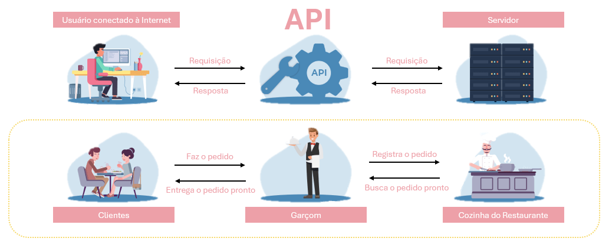

A aula de hoje será sobre Raspagem de Dados na Web e uma Introdução à Mineração de Textos.

Pessoal, vou ser bem direto com vocês: existem milhares de formas de raspar dados na web; e outras tantas de minerar textos. Não faz sentido tentar cobrir tudo aqui.

O que vamos fazer é diferente. Vou escolher algumas abordagens específicas para este momento, com um objetivo muito claro: dar a vocês uma base sólida para começar a trabalhar com dados não estruturados.

Só para alinhar expectativas, por exemplo, **não vamos trabalhar com o pacote `RSelenium`,** que é extremamente poderoso para automação e construção de robôs mais complexos. Isso fica para um próximo momento em nossas trajetórias.

Agora, neste primeiro contato, vamos focar em algo mais direto, mais acessível e, ainda assim, extremamente útil no mundo real: vamos começar com o pacote `rvest`, que faz parte do ecossistema `tidyverse`.

A ideia aqui é simples: aprender como extrair informações de páginas web e começar a transformar conteúdo bruto, como HTML e texto, em dados que a gente consegue analisar. Vamos lá?

# Carregando e/ou Baixando Dados Diretamente de um Servidor Web

Pessoal, nem todo dado disponível online precisa, necessariamente, ser raspado para ser integrado ao seu pipeline. Aliás, adotem o seguinte mantra: **“Se existe *download* estruturado, NÃO faça *scraping*.”**

E isso não é só uma questão de praticidade. Em muitos casos, o *scraping* pode ser interpretado como comportamento suspeito, ou até mesmo como tentativa de invasão, por parte de servidores web.

Em diversas situações, tudo o que você precisa fazer é baixar diretamente o dado com o qual deseja trabalhar. E, para isso, dentro do R, você pode utilizar a função `download.file()`.

Porém, há um detalhe interessante: em muitos casos, você nem precisa dessa etapa intermediária. Dependendo do formato do arquivo, você pode carregar os dados diretamente a partir da URL utilizando funções como a `read_csv()` para arquivos `*.csv` ou `read_xlsx()` para arquivos `*.xlsx`.

Para ilustrar esse processo, vamos trabalhar com dados do [European Centre for Disease Prevention and Control (ECDC)](https://www.ecdc.europa.eu/en/covid-19/data), especificamente com as bases relacionadas à COVID-19.

Dentro do site, navegue até a seção *“Data on COVID-19 vaccination in the EU/EEA (19/04/2024)”*.

Você perceberá que os dados estão disponíveis em diferentes formatos, como Excel (`*.xlsx`), CSV (`*.csv`), JSON e XML.

Agora vem um passo importante: passe o *mouse* (sem clicar) sobre o botão de *download* da base em formato `*.csv`. Na parte inferior do navegador, será exibido o link direto para o arquivo.

A partir desse link, você tem duas abordagens possíveis:

## Opção 1: Carregar diretamente no R

```{r}
#| message: false
#| warning: false
#| paged-print: false
library(tidyverse)

base_csv <- read_csv("https://opendata.ecdc.europa.eu/covid19/COVID-19_VC_data_from_September_2023/csv/data_v7.csv")
```

Note que o objeto `base_csv` foi criado, contendo `r nrow(base_csv)` linhas e `r ncol(base_csv)` colunas:

```{r}
head(base_csv)
```

## Opção 2: Baixar o arquivo primeiro

Essa abordagem é bastante comum para arquivos no formato `*.xlsx`. A maioria das funções do R utilizadas para leitura de planilhas Excel exige que o arquivo esteja disponível localmente antes de ser importado.

```{r}
#| message: false
#| warning: false
#| paged-print: false
library(readxl)

url_xlsx <- "https://opendata.ecdc.europa.eu/covid19/COVID-19_VC_data_from_September_2023/xlsx/data_v7.xlsx"

download.file(
  url = url_xlsx,
  destfile = "dados_ecdc.xlsx",
  mode = "wb"
)

base_xlsx <- read_excel("dados_ecdc.xlsx")
```

Note que encapsulamos a URL em um objeto chamado `url_xlsx`. Em seguida, utilizamos a função `download.file()` para salvar o arquivo localmente e, por fim, o carregamos com `read_excel()`.

Um ponto importante está no argumento `mode = "wb"`. Esse parâmetro indica que o arquivo será gravado em modo binário, o que é essencial para formatos que não são texto puro, como `*.xlsx`, `*.zip`, `*.pdf`, `*.png`. Caso esse argumento não seja utilizado, especialmente em ambientes Windows, podem ocorrer problemas como mensagens a respeito de arquivo corrompido, ou falha ao abrir o arquivo, ou erros na leitura posterior.

Insisto: sempre que estiver lidando com arquivos que não sejam texto simples (como `*.csv` ou `*.txt`), utilize `mode = "wb"` como padrão. Isso evita uma classe inteira de erros difíceis de diagnosticar.

# *Application Programming Interface* (API)

Ok, seus dados não possuem um link direto para *download* ou carregamento? Então o próximo passo é verificar a existência de uma API para acessá-los. E reforçando o mantra: **"Scraping só em último caso!"**

A grande maioria dos portais relevantes de dados disponibiliza APIs. As APIs normalmente retornam os dados já estruturados, frequentemente limpos e padronizados, e acompanhados de documentação. Isso reduz significativamente o esforço necessário para transformar dados brutos em algo analisável.

Aliás, se você já terminou o Desafio 2, deve ter sentido na pele que a maior parte do trabalho da análise de dados, nem diz respeito à análise de dados *per se*; e sim, ao processo de coleta, limpeza e organização das bases de dados.

De forma básica, uma API funciona da seguinte maneira:



Na maioria das vezes, as API costumam retornar nossos pedidos em dois formatos principais: i) no formato de *JavaScript Object Notation* (JSON); e ii) *Extensible Markup Language* (XML). Para esses casos, haverá a necessidade de se conhecer alguns verbos (algoritmos) comuns à maioria das linguagens de programação destinada à análise de dados (e.g. `GET`, `PATCH`, `POST`, `HEAD`, `PUT` e `DELETE`).

-   `GET`: obter dados
-   `POST`: enviar dados
-   `PUT` / `PATCH`: atualizar dados
-   `DELETE`: remover dados
-   `HEAD`: obter metadados

**Para análise de dados, você usará quase sempre o `GET`.**

Não é objetivo do curso aprofundar JSON ou XML neste momento, mas é importante entender que APIs entregam dados estruturados, só que em formatos diferentes do tradicional “tabela”:

+-------------------------------------------------------------------------------------------------------------------------------------+------------------------------------------------------------------------------------------------------------------------------------------------------------------------------------+
| Exemplo JSON                                                                                                                        | Exemplo XML                                                                                                                                                                        |
+=====================================================================================================================================+====================================================================================================================================================================================+
| `{ “firstname”: “Rafael” “surname”: “de Freitas Souza” “profession”: “Professor” “cpf”: “123.456.789-00” “registration”: “98765” }` | `<?xml version = “1.0” encodign=“UTF-8”?>`                                                                                                                                         |
|                                                                                                                                     |                                                                                                                                                                                    |
|                                                                                                                                     | `-<Employee Data> -<employee id=98765> <firstname>Rafael</firstname> <surname>de Freitas Souza</surname> <cpf>123.456.789-00</cpf> <registration>98765</registration> </employee>` |
+-------------------------------------------------------------------------------------------------------------------------------------+------------------------------------------------------------------------------------------------------------------------------------------------------------------------------------+

Porém, a depender da linguagem de computação, algumas API podem se apresentar de forma facilitada, dispensando os verbos mencionados, e elas acabam entregando as requisições num formato personalizado que o usuário deseja, sem muitas necessidades de manipulação de dados. Seja como for, SEMPRE é importante consultar as documentações da API.

Alguns portais de dados, inclusive, encapsulam suas API em pacote, o que torna a tarefa de coletar dados ainda mais prática. Exemplos:

+-------------------------------+----------------------------------------------------------------------------------------------+-------------+
| Repositório                   | Documentação                                                                                 | Pacote      |
+===============================+==============================================================================================+=============+
| Banco Mundial                 | <https://blogs.worldbank.org/en/opendata/accessing-world-bank-data-apis-python-r-ruby-stata> | `WDI`       |
+-------------------------------+----------------------------------------------------------------------------------------------+-------------+
| Federal Reserve Economic Data | <https://fred.stlouisfed.org/docs/api/fred/>                                                 | `fredr`     |
+-------------------------------+----------------------------------------------------------------------------------------------+-------------+
| Banco Central do Brasil       | <https://dadosabertos.bcb.gov.br/dataset/canaisatendimento>                                  | `Quandl`    |
+-------------------------------+----------------------------------------------------------------------------------------------+-------------+
| Mercado de Ações              |                                                                                              | `quantmod`  |
+-------------------------------+----------------------------------------------------------------------------------------------+-------------+
| IPEA                          | <https://www.ipea.gov.br/atlasestado/api>                                                    | `ipeadatar` |
+-------------------------------+----------------------------------------------------------------------------------------------+-------------+

**Resumindo: Antes de raspar um site, pergunte a si mesmo se esse dado já não existe pronto em uma API. Se a resposta for “sim”, você acabou de economizar horas, ou dias, de trabalho.** ~~Não me odeiem por causa do Desafio 02… mas, se quiserem, podem.~~

Vou começar com um exemplo simples, mas poderoso, de uso de API. E sim, não tem absolutamente nada a ver com Contabilidade ou Finanças, mas é divertido e cumpre perfeitamente o papel didático.

**Imagine o seguinte: e se quiséssemos saber, em tempo real, quantas pessoas estão na Estação Espacial Internacional (ISS) neste momento? E mais: onde exatamente ela está?**

Para isso, vamos utilizar uma API pública disponibilizada pelo projeto [Open Notify](http://open-notify.org/). Lá você encontra a documentação das APIs disponíveis. A partir disso, o restante é aplicação direta no R:

```{r}
#| message: false
#| warning: false
#| paged-print: false
library(httr)
library(jsonlite)

iss_populacao <- GET(url = "http://api.open-notify.org/astros.json")

iss_populacao$content

dados_iss_populacao <- fromJSON(txt = rawToChar(x = iss_populacao$content))

```

No primeiro momento, o objeto `iss_populacao` retornado não é ainda um *data frame*. Trata-se de uma resposta HTTP:

```{r}
iss_populacao
```

O objeto `iss_populacao` é uma lista, e nossos dados de interesse estão em `iss_populacao[["content"]]` ou, simplesmente, `iss_populacao$content`. O conteúdo do objeto `iss_populacao$content` está em formato bruto (*raw*), e se você fez a aula de *encoding*, já deve ter entendido o porquê:

```{r}
iss_populacao$content
```

Então, para torná-lo legível, utilizamos a função `rawToChar()`:

```{r}
rawToChar(iss_populacao$content)
```

Agora sim, conseguimos visualizar o JSON retornado pela API.

O próximo passo é converter esse conteúdo para um formato estruturado no R:

```{r}
dados_iss_populacao
```

Perceba o *pipeline*:

1.  Fazemos a requisição (`GET`);
2.  Extraímos o conteúdo (`content`, no caso);
3.  Convertemos de *raw* para texto (`rawToChar`);
4.  Transformamos o JSON em objeto R (`fromJSON`).

Agora vamos buscar a posição da ISS em tempo real.

```{r}
iss_posicao <- GET(url = "http://api.open-notify.org/iss-now.json")

dados_iss_posicao <- fromJSON(txt = rawToChar(iss_posicao$content))

```

Perceba que seguimos exatamente o *pipeline* já estabelecido para as APIs do Open Notify.

Naturalmente, ao trabalhar com APIs de outros repositórios, esse *pipeline* pode variar. Por isso, reforço: **ler a documentação da API não é opcional, é parte do trabalho.**

Dito isso, a posição da ISS já está disponível no objeto `dados_iss_posicao`:

```{r}
dados_iss_posicao
```

Observe que esse objeto é uma lista. A informação que nos interessa está no elemento `iss_position`. Vamos convertê-la em um *data frame* para facilitar a manipulação:

```{r}
df_posicao_iss <- data.frame(dados_iss_posicao$iss_position)
df_posicao_iss
```

O que vem a seguir é um bônus. Aqui entramos no terreno de visualização espacial, que será aprofundado no nosso último encontro:

```{r}
library(tmap)
library(sf)

# Carregando um mapa da Terra
data("World")

# Tranformando os dados em um objeto SF para subsequente plotagem
localizacao_iss <- st_as_sf(x = df_posicao_iss,
                            coords = c("longitude", "latitude"),
                            crs = 4326)

# Plotando a posição da ISS em relação ao solo - 2D
World %>% 
  ggplot() + 
  geom_sf(color = "black", 
          fill = "antiquewhite",
          alpha = 0.3) + 
  geom_sf(data = localizacao_iss, 
          shape = "\U1F6F0", 
          size = 10,
          color = viridis::turbo(12)[[10]]) +
  coord_sf() +
  theme_minimal() +
  theme(panel.background = element_rect(fill = "aliceblue"))
```

ou

```{r}
# Plotando a posição da ISS em relação ao solo - 2D
World %>% 
  ggplot() + 
  geom_sf(color = "black", 
          fill = "antiquewhite",
          alpha = 0.3) + 
  geom_sf(data = localizacao_iss, 
          shape = "\U1F6F0", 
          size = 10,
          color = viridis::turbo(12)[[10]]) +
  coord_sf(crs = "+proj=laea +lat_0=52 +lon_0=10 +x_0=4321000 +y_0=3210000 +ellps=GRS80 +units=m +no_defs") +
  theme_minimal() +
  theme(panel.background = element_rect(fill = "aliceblue"))
```

*Rafa, não tem um exemplo mais da nossa área, não?*

Tem sim. Vamos sair do espaço e voltar para o mundo real.

Agora vamos trabalhar com dados do *World Bank* (Banco Mundial), que disponibiliza uma API extremamente rica e, melhor ainda, já integrada ao R por meio do pacote `WDI`.

```{r}
#| message: false
#| warning: false
#| paged-print: false
library(WDI)
```

Se você consultou a documentação do pacote, e sim, **isso faz parte do trabalho,** deve ter percebido que existe uma função muito útil para explorar os indicadores disponíveis:

```{r eval = F}
WDIsearch() 
```

Essa função retorna uma lista extensa de indicadores do WB.

Para facilitar a exploração, vamos armazenar esse resultado em um objeto:

```{r}
indicadores <- WDIsearch()
```

Assim, podemos melhor visualizá-los da seguinte forma:

```{r}
#| message: false
#| warning: false
#| paged-print: false
library(DT)

indicadores |> 
  datatable()
```

Suponha que estamos interessados em um indicador bastante comum em finanças: Capitalização do mercado de ações em relação ao PIB.

Ao invés de procurar manualmente, podemos usar busca por padrão textual. A função `WDIsearch()` aceita expressões com regex (*Recipe 15*), o que facilita muito:

```{r}
WDIsearch("stock.*mark.*cap.*")
```

Se você cumpriu a *Recipe 15*, deve ter percebido que a regex anterior retorna todos os indicadores que contenham padrões como `“stock”`, `“market”`, `“capitalization”`, mesmo que não estejam exatamente nessa ordem ou forma.

Ok, o indicador que buscamos é o `GFDD.DM.01`. Podemos baixá-lo com a função `WDI()`. E como o tio Rafa sabe disso? Adivinha? Pois é, ele leu a documentação da API.

```{r}
WDI(indicator = "GFDD.DM.01", 
    country = "BR",
    start = 2004, 
    end = 2024)
```

# Raspando Dados

*“Rafa, não há como baixar ou carregar os dados diretamente de um repositório, e nem há uma API disponível. O que fazer?”*

Aqui entramos em um território que, sinceramente, eu evito sempre que possível, mas que, em alguns casos, se torna necessário: o *web scraping*.

Evito essa abordagem por dois motivos principais:

1.  Os dados raspados raramente vêm organizados e limpos... na prática, quase nunca mesmo;
2.  Muitos servidores web interpretam o *scraping* como um comportamento indesejado.

Antes que alguém se preocupe: não, a Polícia Federal não vai bater na sua porta simplesmente por extrair uma tabela de um site (~~não me irrita~~). Porém, é importante entender o contexto técnico por trás disso.

Quando você faz *scraping*, está automatizando requisições a um servidor. Dependendo de como isso é feito, especialmente em grande volume ou em alta frequência, esse comportamento pode se assemelhar ao padrão de tráfego gerado por ataques *hacker* do tipo *Denial of Service* (DoS).

Um ataque DoS tem como objetivo sobrecarregar um servidor com múltiplas requisições, a ponto de comprometer sua capacidade de resposta para outros usuários.

**Não é isso que estamos fazendo aqui.** Porém, do ponto de vista do servidor, muitas requisições automatizadas em sequência podem parecer exatamente isso.

Imagine que você está em uma sala e, de repente, dezenas de pessoas começam a te fazer perguntas ao mesmo tempo. Você não consegue responder a todas. Em algum momento, você se confunde ou trava. Com servidores web, a lógica é semelhante: diante de muitas requisições simultâneas, há a questão do processamento limitado e a possível degradação ou bloqueio de seu acesso.

No passado, um DoS era comumente utilizado para derrubar servidores. Atualmente, com o avanço tecnológico, a consequência mais comum de um DoS é o bloqueio temporário do seu IP; e/ou a limitação de seu acesso (*rate limiting*); e/ou respostas incompletas ou com erro.

Para evitar esse tipo de problema, utilizamos a função `Sys.sleep()`. Essa função insere uma pausa (em segundos) entre uma requisição e outra. Exemplo:

```{r}
Sys.sleep(3)
```

Notou que seu R ficou "travado" por 3 segundos?

O ponto é que se você automatiza acesso, você também precisa simular comportamento humano. A `Sys.sleep()` nos ajudará a evitar requisições em alta frequência, a respeitar intervalos de tempo e não sobrecarregar o servidor.

**Posto isso, scraping não é proibido, mas exige responsabilidade! E lembrem-se: se existe API ou download estruturado, scraping deixa de ser solução e passa a ser gambiarra.**

Vamos começar com algo simples e visitar a página sobre [web scraping da Wikipedia](https://en.wikipedia.org/wiki/Web_scraping) (~~conveniente, não?~~).

Olhem com atenção para essa página. Não é necessário ler todo o conteúdo agora (~~se quiser, pode~~); o foco é a estrutura da página.

Em regra, quando navegamos na web, estamos lidando com documentos em *HyperText Markup Language* (HTML). Tudo o que vocês veem na tela, absolutamente tudo, está ali por causa desse código! Então, as cores, as fontes, os tamanhos, as posições, as imagens, os links, nada ali é aleatório.

Dito isso, agora vem a parte que parece contraintuitiva: **scraping não é sobre texto; scraping é sobre estrutura da página que você pretende raspar.**

**E antes que alguém se preocupe, você não precisa aprender HTML profundamente.** Porém precisa, no mínimo, entender o básico da sua estrutura, **porque é isso que vai permitir responder à pergunta central do *scraping*: “Onde exatamente está o dado que eu quero?”**

De forma absolutamente suscinta, um arquivo HTML costuma se organizar da seguinte forma:

## Doctype

```{r eval = F}
#Não comandar

<!DOCTYPE html> 
```

O doctype indica para o navegador que aquele documento segue o padrão HTML moderno. É como se fosse o ‘tipo de arquivo’ que o navegador precisa entender antes de começar a ler.

De maneira objetiva, para o scraping, o doctype é irrelevante na prática, mas bom saber que sempre está lá.

## `<html>` e `</html>`

```{r eval = F}
#Não comandar
<!DOCTYPE html> 

<html>
  
  ...

</html>
```

Essas são as chaves que guardam a raiz do documento HTML. Tudo o que existe na página está dentro dessa estrutura. Note que se inicia com `<html>` e termina com `</html>`. Esse é um padrão recorrente no HTML, isto é, começar com `<algo aqui>` e fechar com `</algo aqui>`.

## `<body>` e `</body>`

```{r eval = F}
#Não comandar

<!DOCTYPE html> 
  
<html>
  
  ...

<body>
  
  ...

</body>

</html>
```

Aqui está o conteúdo visível da página, ou seja, tudo que o usuário enxerga, tais como textos, imagens, links, tabelas, etc. Tudo o que é visível está dentro do `<body>`.

## Headings

```{r eval = F}
#Não comandar

<h1>Título principal</h1>
  
<h2>Subtítulo</h2>
  
<h3>Seção</h3>
```

Os headings representam títulos e subtítulos, isto é, a hierarquia do texto, que se comporta, em regra, como se segue:

-   <h1>

    : título mais importante

-   <h6>

    : nível de título menos importante

Para o scraping, os headings são ótimos para capturar títulos de páginas, notícias, produtos etc.

## Parágrafos

```{r eval = F}
#Não comandar

<p>Esse é um parágrafo.</p>
```

Os parágrafos são usados para conter blocos de texto. Literalmente, é onde mora o conteúdo textual.

Por assim ser, para o scraping, os parágrafos são úteis para extrair descrições, artigos, reviews, etc.

## Hiperlinks

```{r eval = F}
#Não comandar

<a href="https://exemplo.com">Clique aqui</a>
```

Os hiperlinks definem um link clicável e possuem dois componentes principais:

-   `href`: o destino do link (para onde ele leva)
-   texto: o tal "Clique aqui", isto é, o que o usuário vê na página

Para o scraping, os hiperlinks são essenciais para navegar entre páginas (paginação) e para coletar URLs.

Para fixar a ideia, suponha que desejemos capturar um hiperlink. Com o pacote `rvest`, você deveria fazer o seguinte:

```{r eval = F}
#Não comandar

pagina |> 
  html_elements("a") |> 
  html_attr("href")
```

O código anterior é algo como: "R, na página indicada, encontre todos os elementos `<a>` e extraia o valor do atributo `href`."

Para facilitar, muitos elementos HTML possuem **atributos** que ajudam a identificar exatamente onde está a informação desejada.

Exemplo:

```{r eval = F}
#Não comandar

<a href="https://exemplo.com" class="link-produto" id="principal">
  Clique aqui
</a>
```

Aqui nós temos:

-   `href`: destino do link
-   `class`: classificação do elemento
-   `id`: identificador único

**Esses atributos são fundamentais para o scraping, pois permitem selecionar elementos de forma mais precisa.**

**Se você quiser visualizá-los, na página da Wikipedia que você abriu, aperte F12 ou Ctrl+Shift+I.**

Assim, indicando a classe, o exemplo anterior poderia ser:

```{r eval = F}
# Não comandar

pagina |> 
  html_elements(".link-produto") |> 
  html_attr("href")
```

ou ainda, indicando o id:

```{r eval = F}
# Não comandar

pagina |> 
  html_elements("#principal") |> 
  html_attr("href")
```

### Exemplo de Raspagem de Dados no Wikipedia

Vamos navegar até [a página sobre web scraping da Wikipedia](https://en.wikipedia.org/wiki/Web_scraping).

Ao acessar a página, pressione **F12** ou **Ctrl+Shift+I** para inspecionar o código-fonte, isto é, a estrutura HTML da página. **Lembre-se: o objetivo aqui não é ler o conteúdo, mas entender onde os dados estão.**

Para esse exemplo, utilizaremos principalmente o pacote `rvest`, que será responsável pela extração dos dados.

```{r}
#| message: false
#| warning: false
#| paged-print: false
library(rvest)
library(xml2)
```

Vamos começar encapsulando o endereço da página:

```{r}
url_wiki <- "https://en.wikipedia.org/wiki/Web_scraping"
```

Agora, vamos carregar toda a estrutura HTML da página:

```{r}
wikipedia <- read_html(url_wiki)
```

**Nesse momento, você não tem dados estruturados.** Você tem a árvore HTML completa da página.

Suponha que queremos capturar o título da página:

```{r}
titulo_wiki <- wikipedia |> 
  html_elements("title") |> 
  html_text()
```

Note o resultado:

```{r}
titulo_wiki
```

Aqui nós usamos o seguinte:

-   `"title"`: seletor HTML;
-   a função `html_text()`: para extrair o texto do elemento

Agora, vamos capturar os parágrafos da página:

```{r}
paragrafo_wiki <- wikipedia |>  
  html_elements("p") |>
  html_text()
```

Observe o resultado:

```{r}
paragrafo_wiki
```

Perceba que esse código retorna todos os parágrafos da página, inclusive conteúdo irrelevante, eventuais notas de rodapé e textos de navegação. Noutras palavras, a abordagem funciona, mas ainda não está refinada.

Vamos supor que desejemos raspar algo muito específico, tal como o conteúdo da Referência 6 da página:

```{r}
referencia6_wiki <- wikipedia |> 
  html_elements("#cite_note-6") |> 
  html_text()
```

O seletor `"#cite_note-6"` significa encontre o elemento HTML cujo atributo `id` é igual a `cite_note-6`.

Esse elemento representa toda a referência, não só o link, mas também o texto descritivo, as datas, as notas e outros links internos. Note que o resultado foi o seguinte:

```{r}
referencia6_wiki
```

E se quiséssemos buscar o link que consta na Referência 6? Aqui entra o refinamento do seletor:

```{r}
wikipedia |> 
  html_elements("#cite_note-6 a") |> 
  html_attr("href")
```

O seletor agora passou a ser `"#cite_note-6 a"`, que significa algo como “dentro do elemento `#cite_note-6`, encontre todas as tags `<a>`.”

E sim, apareceram dois resultados. Basta a gente usar um pouco de regex (~~ô saudade da *Recipe 15*~~), e tudo resolvido:

```{r}
wikipedia |> 
  html_elements("#cite_note-6 a") |> 
  html_attr("href") |> 
  str_subset("^http")
```

### Exemplo de Raspagem de Dados com *Loops*

O exemplo da Wikipedia é interessante, mas bastante simples. Em muitos casos, estamos interessados em um nível de raspagem **que envolve múltiplas páginas,** o que torna a coleta manual completamente inviável.

Para simular essa situação, vamos utilizar um repositório público, minimizando o risco de bloqueios por excesso de requisições (*rate limiting* ou comportamento semelhante a DoS).

Vamos começar visitando o site da [Crossref](https://www.crossref.org/) e buscar por *Data Science* no formulário dedicado à busca de metadados.

Observe que os resultados estão distribuídos em várias páginas, e que cada página contém 20 observações. Cada observação possui informações como a data, o título, a revista e o DOI.

Podemos navegar entre as páginas utilizando os botões ao final da página. **Clique para ir até a segunda página.**

**ATENÇÃO:** Há uma razão técnica para começarmos a análise a partir da segunda página. Em muitos sistemas web, a URL da primeira página segue um padrão diferente das demais. Já a partir da segunda página, a estrutura da URL tende a ser consistente. E é exatamente isso que queremos para automatizar o processo.


Para começar, vamos armazenar a URL em um objeto que chamaremos de `url_base`:
```{r}
url_base <- "https://search.crossref.org/?from_ui=&q=data+science&page=2"
```

Há muitas informações nesse link, basicamente todos os campos que poderiam ter sido especificados na busca são apresentados no endereço.

Também podemos observar que a pesquisa retornou mais de 11 milhões de páginas e que a página atual, que é a segunda página, é a de número 2 (`page=2`). Nesse caso, a primeira página da pesquisa é numerada como `1` nesta ferramenta de busca, mas o padrão muda de página para página. Logo, o que faremos aqui, vale para esse portal em específico. **Sempre comecem explorando a partir da segunda página.**

Podemos ver que há muitas páginas de resultado para a palavra-chave que utilizamos. Nosso desafio é conseguir passar de forma eficiente por elas, ou seja, acessá-las e raspar o seu conteúdo. Para isso, usaremos uma função essencial na programação, o comando `for` que estudamos na *Recipe 10*.


Temos que escrever uma pequena instrução que indique ao programa que queremos passar pelas páginas de resultado da Crossref, substituindo apenas o número da página atual (`page`) no endereço URL que guardamos no objeto `url_base`.

Nos falta, porém, uma função que nos permita substituir, no texto base da URL, os números das páginas.

Há mais de uma forma de realizar essa tarefa, mas aqui utilizaremos a função `gsub()`. Com essa função, podemos substituir um trecho de um texto por outro, de acordo com um critério específico.

A função `gsub()` funciona da seguinte forma:
```{r}
texto <- "Hoje é um dia bonito"

gsub(pattern = "bonito", 
     replacement = "ensolarado", 
     x = texto)

```
Agora que sabemos substituir partes de textos e construir *loops*, podemos alterar o número da página dentro do nosso endereço de pesquisa.

Ao analisar a URL, percebemos que o que varia ao navegar entre páginas é o parâmetro:

```{r eval = F}
# Não comandar

page=1 → page=2 → page=3 → ...
```


Posto de outra forma, o valor de `page` (o número da página) é o elemento dinâmico da URL, e esse é exatamente o ponto que vamos automatizar!

Para tanto, vamos substituir os números de `page` por um ***placeholder***, ou seja, um valor “genérico” que indica onde o número da página deverá ser inserido posteriormente. Esse *placeholder* pode ser qualquer texto. Aqui, utilizaremos `PAGINA`:
```{r}
url_crossref <- "https://search.crossref.org/?from_ui=&q=data+science&page=PAGINA"
```
Note que no objeto anterior, substituímos o valor de `page` por `PAGINA`.

Na URL, o valor `PAGINA` aparece sem aspas, pois faz parte do texto. Poém, ao utilizar a função `gsub()`, devemos usar aspas, pois estamos procurando uma string literal.

Assim, se quisermos gerar o link da página 12:
```{r}
gsub("PAGINA", 12, url_crossref)
```
**Perceberam que o valor de `page` passou a ser `12`? Perceberam que, em nossa estratégia, nós não estamos alterando o site, e sim, apenas reconstruindo a URL de forma programática?**

Então, vamos começar a construir nosso `for`, supondo que tenhamos interesse nas primeiras 10 páginas. Poderíamos, claro, percorrer todas as páginas disponíveis, mas vamos trabalhar com 10 por uma questão didática.

```{r}
for(i in 1:10){
  
  url_final <- gsub("PAGINA", i, url_crossref)
  
  print(url_final)
  
}
```

Até aqui, o que fizemos foi simples, mas extremamente importante: nós automatizamos a construção das URLs! Noutras palavras, ensinamos o R a fazer algo que faríamos manualmente: clicar nas páginas 1, 2, 3… até a 10.

**Porém, até agora, nós só geramos os endereços; e nós ainda não acessamos o conteúdo dessas páginas.**

Para acessar o conteúdo de uma página, precisamos de uma função que faça algo semelhante ao que o seu navegador faz: enviar uma requisição ao servidor e receber o HTML da página.

No R, fazemos isso com a função `read_html()`, do pacote `rvest`. Vamos testar sua funcionalidade na página 2, apenas. Encare como um teste.

```{r}
url_pagina <- "https://search.crossref.org/?from_ui=&q=data+science&page=2"

crossref_pg2 <- read_html(url_pagina) 
```

Aqui, o R acessa a URL e armazena toda a estrutura HTML da página no objeto `crossref_pg2`, e agora que temos o HTML, podemos começar a buscar os dados:
```{r}
resultado_crossref <- crossref_pg2 |> 
  html_elements("td.item-data")
```

Esse comando significa o seguinte: “Dentro da página, encontre todos os elementos `<td>` que possuem a classe `item-data`” (Estou assumindo que você explorou o código de fonte da página).

Um atalho mental, seria o seguinte:

- espaço `" "`: significa dentro de
- ponto `"."`: significa tem essa classe
- hashtag `"#"`: significa tem esse id

Note que nosso objeto `resultado_crossref` é uma lista que compreende um conjunto de nós HTML, em que cada elemento representa um resultado da busca:
```{r}
resultado_crossref
```

Cada um desses elementos funciona como uma “caixinha” contendo as informações de um resultado.

Para entender melhor essa estrutura, podemos inspecionar um elemento específico:
```{r}
resultado_crossref[[1]]
```

Agora conseguimos visualizar a organização interna do HTML.

Observe o seguinte:

- o título está dentro da tag `p` com classe `lead`
- os autores estão dentro da tag `p` com classe `expand`
- o link (DOI) está dentro da tag `a`, no atributo `href`

**1. Salvando os títulos:**
```{r}
titulos <- resultado_crossref |> 
  html_element("p.lead") |> 
  html_text(trim = TRUE) # Função para capturar os textos, removendo espaços vazios
```

Observe:
```{r}
titulos
```

**2. Salvando os autores:**
```{r}
autores <- resultado_crossref |> 
  html_element("p.expand") |> 
  html_text(trim = TRUE) # Função para capturar os textos, removendo espaços vazios
```

Veja:
```{r}
autores
```

**3. Salvando os DOIs:**
```{r}
doi <- resultado_crossref |> 
  html_element("a") |> 
  html_attr("href")
```

Note:
```{r}
doi
```


Para salvar tudo num dataset, poderíamos fazer o seguinte:
```{r}
df_crossref_pg2 <- data.frame(titulos, autores, doi)
```
E poderíamos observar o que foi feito até aqui:
```{r}
df_crossref_pg2
```

De fato, alguns resultados não possuem títulos ou autores explicitados no site, mas apresentam DOI. Assim, mesmo com imperfeições, já conseguimos estruturar uma base inicial de dados sobre o tema *Data Science*.

**Agora surge a pergunta central: como conectar o for com a extração dos dados?**

Primeiramente, vamos começar criando uma lista vazia que armazenará os resultados de cada página:
```{r}
repositorio <- list()
```

Depois, é aplicação direta do que fizemos:

```{r}
for(i in 1:10){
  
  message(
    paste(
      "Raspando a página",
      i,
      "de 10"
    )
  ) # Deixei avisos do R para você saber em que momento do algoritmo você está
  
  url_final <- gsub("PAGINA", i, url_crossref)
  
  
  # Lendo a página e capturando seus elementos
  crossref_html <- read_html(url_final) |> 
    html_elements("td.item-data")
  
  Sys.sleep(1) # Deixei um Sys.sleep "simbólico" aqui
  
 # Salvando os títulos
  titulos <- crossref_html |> 
    html_element("p.lead") |> 
    html_text(trim = TRUE)
  
  # Salvando os autores
  autores <- crossref_html |> 
    html_element("p.expand") |> 
    html_text(trim = TRUE)
  
  # Salvando os DOIs
  doi <- crossref_html |> 
    html_element("a") |> 
    html_attr("href")
  
  df <- data.frame(
    titulos,
    autores,
    doi
  )
  
  repositorio[[i]] <- df
  
}
```
Só que `repositorio` é uma lista, mais especificamente, uma lista de *data frames*, em que cada elemento corresponde aos resultados de uma página.

Para consolidar tudo em uma única base, podemos empilhar esses *data frames*:
```{r}
df_crossref_final <- bind_rows(repositorio)
```
Agora sim, temos um único *data frame* contendo os resultados das múltiplas páginas que percorremos.

Nada mal para subsidiar um início de revisão de literatura, certo?
